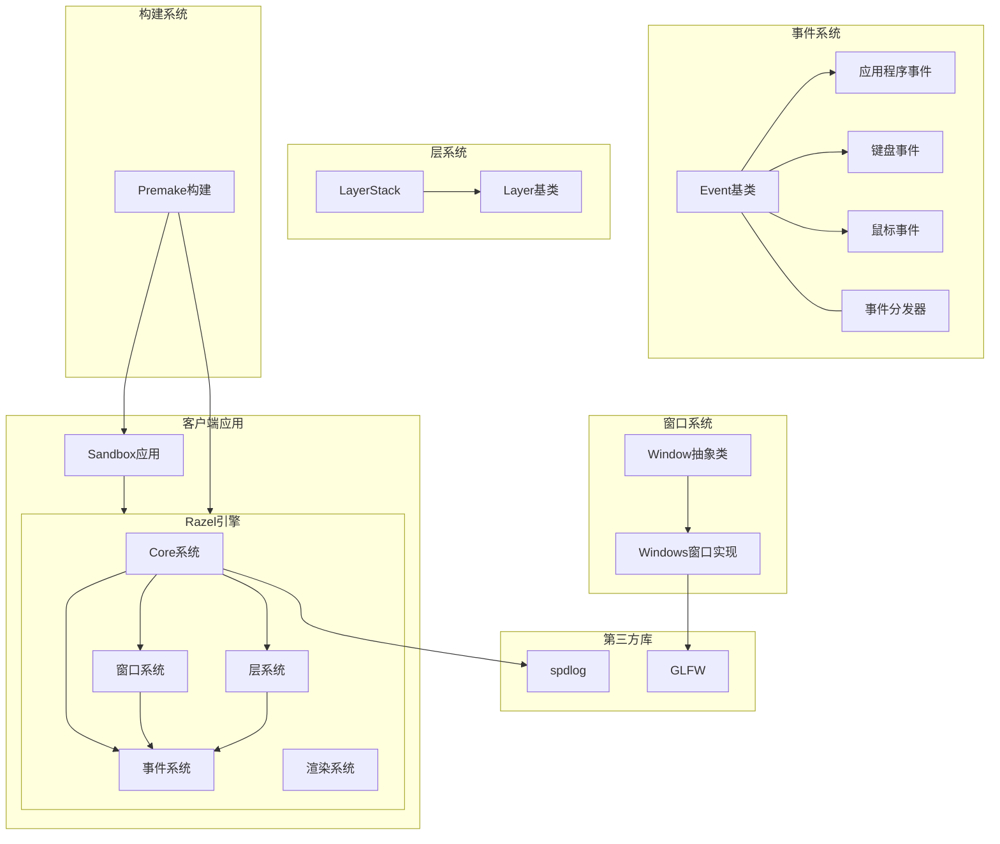
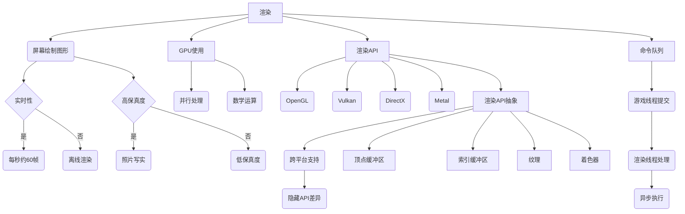

# Razel
Just Learning Hazel Game Engine for Graduation Design

```bash
git clone --recursive https://github.com/Jenwein/Razel.git
```

--or

```bash
git clone https://github.com/Jenwein/Razel.git
git submodule update --recursive --init
```






