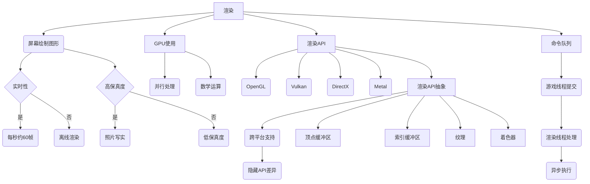
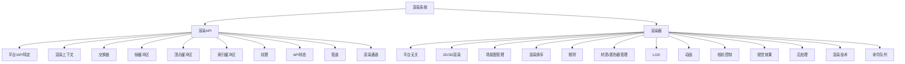
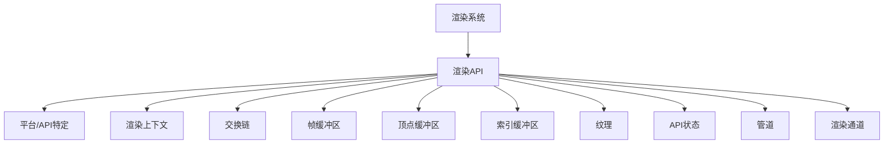
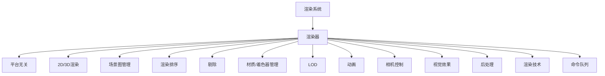

```mermaid
graph TD
    A[渲染] --> B(屏幕绘制图形);
    B --> C{实时性};
    C -- 是 --> D(每秒约60帧);
    C -- 否 --> E(离线渲染);
    B --> F{高保真度};
    F -- 是 --> G(照片写实);
    F -- 否 --> H(低保真度);
    A --> I[GPU使用];
    I --> J(并行处理);
    I --> K(数学运算);
    A --> L[渲染API];
    L --> M(OpenGL);
    L --> N(Vulkan);
    L --> O(DirectX);
    L --> P(Metal);
    L --> Q[渲染API抽象];
    Q --> R(跨平台支持);
    R --> S(隐藏API差异);
    Q --> T[顶点缓冲区];
    Q --> U[索引缓冲区];
    Q --> V[纹理];
    Q --> W[着色器];
    A --> X[命令队列];
    X --> Y(游戏线程提交);
    Y --> Z(渲染线程处理);
    Z --> AA(异步执行);
```

```mermaid
graph TD
    A[渲染系统] --> B[渲染API];
    A --> C[渲染器];
    B --> D[平台/API特定];
    C --> E[平台无关];
    B --> F[渲染上下文];
    B --> G[交换链];
    B --> H[帧缓冲区];
    B --> I[顶点缓冲区];
    B --> J[索引缓冲区];
    B --> K[纹理];
    B --> L[API状态];
    B --> M[管道];
    B --> N[渲染通道];
    C --> O[2D/3D渲染];
    C --> P[场景图管理];
    C --> Q[渲染排序];
    C --> R[剔除];
    C --> S[材质/着色器管理];
    C --> T[LOD];
    C --> U[动画];
    C --> V[相机控制];
    C --> W[视觉效果];
    C --> X[后处理];
    C --> Y[渲染技术];
    C --> Z[命令队列];
```

```mermaid
graph TD
    A[渲染系统] --> B[渲染API];
    B --> D[平台/API特定];
    B --> F[渲染上下文];
    B --> G[交换链];
    B --> H[帧缓冲区];
    B --> I[顶点缓冲区];
    B --> J[索引缓冲区];
    B --> K[纹理];
    B --> L[API状态];
    B --> M[管道];
    B --> N[渲染通道];
```

```mermaid
graph TD
    A[渲染系统] --> C[渲染器];
    C --> E[平台无关];
    C --> O[2D/3D渲染];
    C --> P[场景图管理];
    C --> Q[渲染排序];
    C --> R[剔除];
    C --> S[材质/着色器管理];
    C --> T[LOD];
    C --> U[动画];
    C --> V[相机控制];
    C --> W[视觉效果];
    C --> X[后处理];
    C --> Y[渲染技术];
    C --> Z[命令队列];
```

