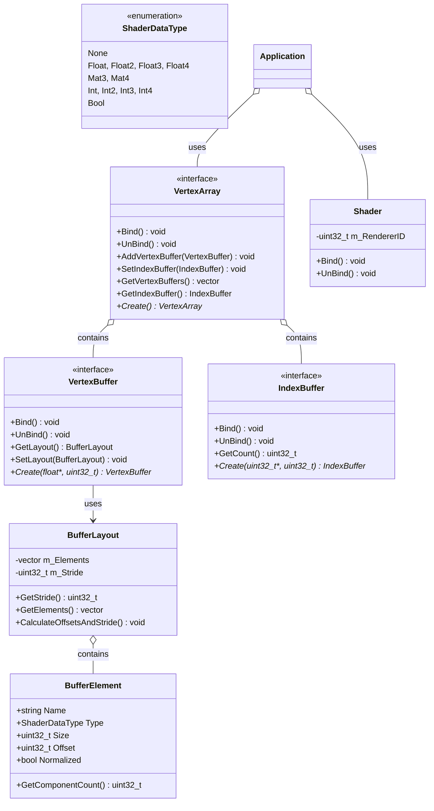

# 渲染系统抽象结构设计分析

通过查看代码，我可以看出这是一个基于现代图形API（如OpenGL）设计的渲染抽象系统。下面是该系统的详细分析：

## 核心组件及其关系

### 1. 着色器数据类型 (ShaderDataType)
- 定义了各种着色器支持的数据类型：Float, Float2, Float3, Float4, Mat3, Mat4, Int, Int2, Int3, Int4, Bool
- 提供了计算不同数据类型所占字节大小的辅助函数

### 2. 缓冲区元素 (BufferElement)
- 描述顶点属性的结构体
- 包含属性名称、数据类型、大小、偏移量和是否规范化
- 提供获取组件数量的方法

### 3. 缓冲区布局 (BufferLayout)
- 管理一组BufferElement
- 自动计算每个元素的偏移量和总步长
- 提供迭代器接口以便访问所有元素

### 4. 顶点缓冲区 (VertexBuffer)
- 抽象接口类，具体实现由平台相关代码提供
- 负责存储和管理顶点数据
- 支持绑定/解绑操作及布局设置
- 使用工厂方法(Create)创建实例

### 5. 索引缓冲区 (IndexBuffer)
- 抽象接口类
- 存储顶点索引，优化渲染性能
- 提供获取索引数量的方法
- 同样使用工厂方法创建实例

### 6. 顶点数组 (VertexArray)
- 整合多个顶点缓冲区和一个索引缓冲区
- 作为渲染的高层抽象
- 管理顶点数据和顶点属性的绑定关系

### 7. 着色器 (Shader)
- 管理顶点着色器和片段着色器代码
- 提供绑定/解绑功能
- 持有渲染API相关的着色器程序ID

## 架构图

## 设计模式和特点

1. **工厂模式**：通过静态Create方法创建具体实现类
2. **接口分离**：定义了清晰的抽象接口，便于不同平台的实现
3. **组合模式**：VertexArray组合了VertexBuffer和IndexBuffer
4. **RAII原则**：资源在构造时获取，析构时释放

这种抽象结构设计实现了渲染API的封装，让应用层代码可以不直接依赖于特定的图形API（如OpenGL、DirectX等），提高了代码的可移植性和维护性。
