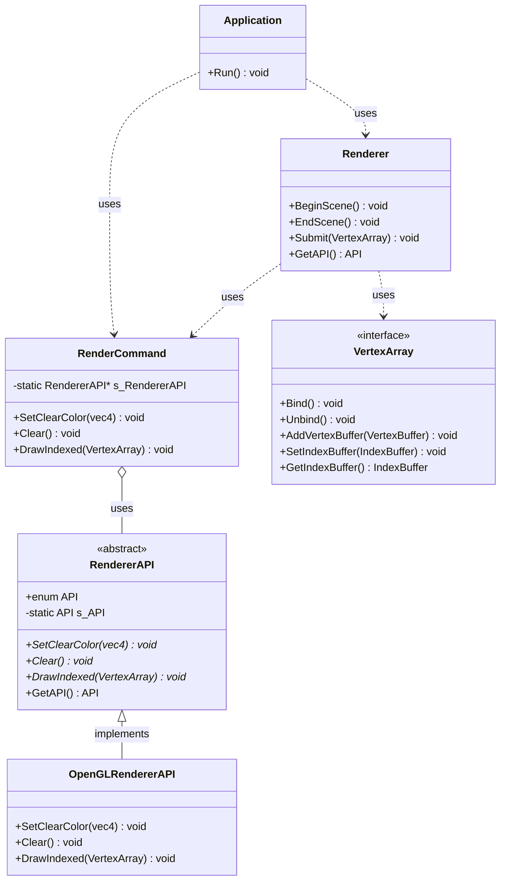
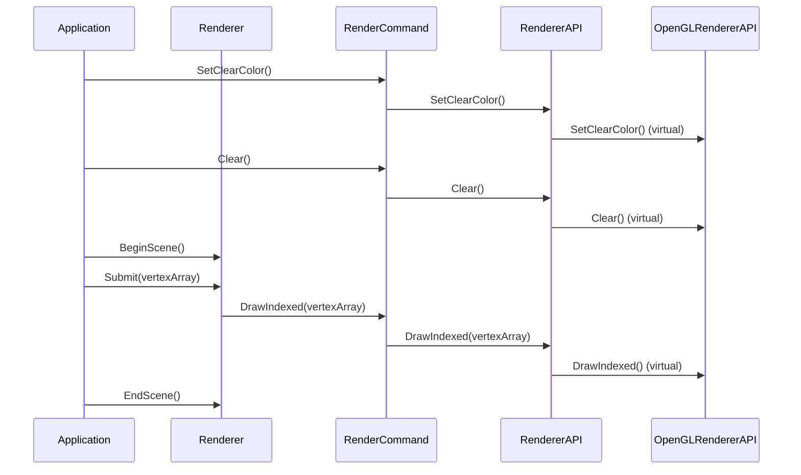
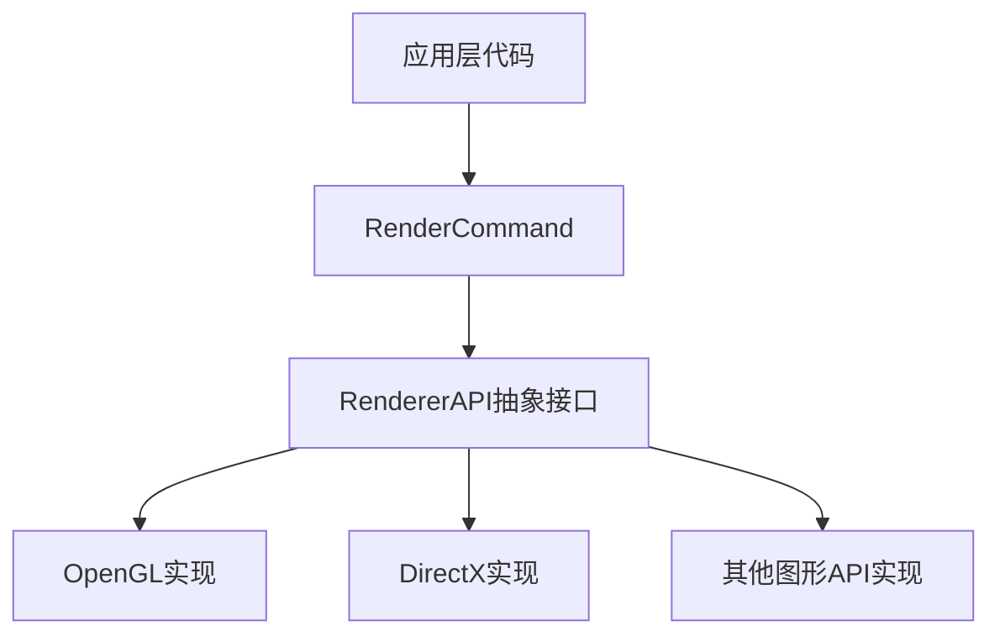
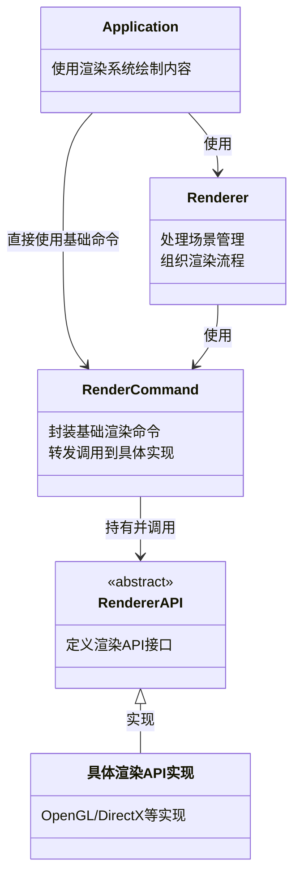
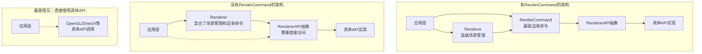

# RendererAPI 和 RenderCommand 设计分析

## 总体架构设计

这个引擎采用了多层次的渲染抽象，主要组件包括：RendererAPI、RenderCommand 和 Renderer。这种设计体现了良好的面向对象设计原则和设计模式的应用。

### RendererAPI

`RendererAPI` 是一个抽象基类，定义了不同渲染API需要实现的基本接口：

```cpp
class RendererAPI
{
public:
    enum class API { None = 0, OpenGL = 1, DirectX11 = 2 };
    
    virtual void SetClearColor(const glm::vec4 color) = 0;
    virtual void Clear() = 0;
    virtual void DrawIndexed(const std::shared_ptr<VertexArray>& vertexArray) = 0;
    
    inline static API GetAPI() { return s_API; }
private:
    static API s_API; // 默认为OpenGL
};
```

这是一个典型的**策略模式**应用，允许在运行时切换不同的渲染API实现。

### RenderCommand

`RenderCommand` 是一个静态接口类，它封装了渲染命令，通过内部的 `RendererAPI` 指针转发调用：

```cpp
class RenderCommand
{
public:
    inline static void SetClearColor(const glm::vec4 color)
    {
        s_RendererAPI->SetClearColor(color);
    }
    
    inline static void Clear()
    {
        s_RendererAPI->Clear();
    }
    
    inline static void DrawIndexed(const std::shared_ptr<VertexArray>& vertexArray)
    {
        s_RendererAPI->DrawIndexed(vertexArray);
    }
    
private:
    static RendererAPI* s_RendererAPI;
};
```

### Renderer

`Renderer` 提供了更高层次的渲染功能，用于管理整个渲染流程：

```cpp
class Renderer
{
public:
    static void BeginScene();
    static void EndScene();
    static void Submit(const std::shared_ptr<VertexArray>& vertexArray);
    
    inline static RendererAPI::API GetAPI() { return RendererAPI::GetAPI(); }
};
```

### 为什么这样设计

1. **分离关注点**：
   - RendererAPI 关注特定图形API的实现细节
   - RenderCommand 提供统一的命令接口
   - Renderer 处理高层渲染逻辑和场景管理

2. **平台无关性**：
   - 抽象化渲染API，使上层代码不依赖于特定图形API
   - 可以轻松切换底层实现（OpenGL、DirectX等）

3. **命令模式应用**：
   - RenderCommand 将渲染操作封装为命令
   - 简化调用方式，提高代码可读性

4. **静态接口优势**：
   - 避免过多对象创建
   - 简化API调用语法
   - 提高性能

5. **扩展性**：
   - 新增渲染功能只需扩展相应接口
   - 添加新的渲染后端只需派生新的RendererAPI实现

### 类图



### 系统调用流程



这种分层设计实现了渲染系统的良好抽象，使得引擎能够适应不同渲染API，同时保持上层代码的一致性和简洁性。

### 相关代码

#### RendererAPI

`RendererAPI`是一个抽象基类，定义了不同渲染API（如OpenGL、DirectX等）需要实现的接口:

```cpp
class RendererAPI
{
public:
    enum class API
    {
        None = 0, OpenGL = 1, DirectX11 = 2
    };
public:
    virtual void SetClearColor(const glm::vec4 color) = 0;
    virtual void Clear() = 0;
    virtual void DrawIndexed(const std::shared_ptr<VertexArray>& vertexArray) = 0;
    inline static API GetAPI(){return s_API;}
private:
    static API s_API;
};
```

`RendererAPI`有一个静态成员变量`s_API`，默认设置为OpenGL，这表示渲染系统默认使用OpenGL。

#### OpenGLRendererAPI

`OpenGLRendererAPI`是`RendererAPI`的具体实现，它实现了基于OpenGL的渲染功能:

```cpp
class OpenGLRendererAPI : public RendererAPI
{
public:
    virtual void SetClearColor(const glm::vec4 color)override;
    virtual void Clear()override;
    virtual void DrawIndexed(const std::shared_ptr<VertexArray>& vertexArray)override;
};
```

#### RenderCommand

`RenderCommand`作为一个静态接口，通过组合`RendererAPI`来提供渲染命令：

```cpp
class RenderCommand
{
public:
    inline static void SetClearColor(const glm::vec4 color)
    {
        s_RendererAPI->SetClearColor(color);
    }

    inline static void Clear()
    {
        s_RendererAPI->Clear();
    }

    inline static void DrawIndexed(const std::shared_ptr<VertexArray>& vertexArray)
    {
        s_RendererAPI->DrawIndexed(vertexArray);
    }

private:
    static RendererAPI* s_RendererAPI;
};
```

#### Renderer

`Renderer`提供了更高层次的渲染功能，如场景管理，使用`RenderCommand`来执行具体的渲染操作：

```cpp
class Renderer
{
public:
    static void BeginScene();
    static void EndScene();
    static void Submit(const std::shared_ptr<VertexArray>& vertexArray);
    inline static RendererAPI::API GetAPI() { return RendererAPI::GetAPI(); }
};
```

实现：

```cpp
void Renderer::BeginScene()
{
    // 设置场景信息
}

void Renderer::EndScene()
{
    // 场景结束
}

void Renderer::Submit(const std::shared_ptr<VertexArray>& vertexArray)
{
    vertexArray->Bind();
    RenderCommand::DrawIndexed(vertexArray);
}
```

### 设计模式分析

这种设计应用了多种设计模式：

1. **抽象工厂模式**: `RendererAPI`作为抽象工厂，可以生成不同平台的渲染接口。

2. **策略模式**: 不同的渲染API实现(如OpenGL, DirectX)可以被视为不同的策略。

3. **命令模式**: `RenderCommand`将渲染操作封装成命令。

4. **外观模式**: `Renderer`为复杂的渲染系统提供了一个简化的接口。

5. **桥接模式**: 将抽象(渲染操作)与实现(特定渲染API)分离。

### 为什么这样设计

1. **平台无关性**: 抽象出RendererAPI让代码不依赖于特定图形API，便于切换不同的图形后端。

2. **清晰的层次划分**:
   - `RendererAPI`: 定义图形API需要的基本接口
   - `RenderCommand`: 提供简化的静态接口来执行基本渲染命令
   - `Renderer`: 提供高层次的渲染功能，如场景管理

3. **解耦合**: 渲染逻辑与具体实现分离，便于维护和扩展。

4. **易于切换**: 只需改变RendererAPI的实现，不需要修改上层代码。

5. **可扩展性**: 可以方便地添加新的渲染API支持，如Vulkan、DirectX12等。

这种设计方式也常见于其他游戏引擎和图形库中，如Unreal Engine和Unity。


## RenderCommand的核心作用

RenderCommand作为渲染系统中的一个关键层，在整个渲染抽象体系中扮演着重要角色，主要是为了之后可以用于**多线程渲染和延迟执行命令**。它的主要意义包括：

### 1. 命令封装与简化

RenderCommand将底层渲染API的操作封装成简单的静态方法，使得调用渲染命令变得非常简洁：

```cpp
RenderCommand::SetClearColor({ 0.1f, 0.1f, 0.1f, 1.0f });
RenderCommand::Clear();
RenderCommand::DrawIndexed(vertexArray);
```

无需创建实例、管理对象生命周期或处理复杂的API调用。

### 2. 应用命令模式

RenderCommand实际上是**命令模式**的一种实现，将各种渲染操作封装为独立的命令，使得渲染操作可以：
- 被统一管理
- 便于扩展新命令
- 可能未来支持命令队列、批处理等高级功能

### 3. 分离接口和实现



RenderCommand提供了一个统一的接口层，将"调用什么"与"如何实现"完全分离。

### 4. 性能优化潜力

这种设计允许：
- 未来实现命令缓冲和批处理
- 渲染状态优化和排序
- 多线程渲染命令收集

### 5. 简化渲染器层代码

对比Renderer类和RenderCommand类的代码：

```cpp
// Renderer的Submit方法
void Renderer::Submit(const std::shared_ptr<VertexArray>& vertexArray)
{
    vertexArray->Bind();
    RenderCommand::DrawIndexed(vertexArray);
}
```

Renderer可以专注于更高级的场景管理逻辑，而将底层渲染操作委托给RenderCommand。

### 6. 静态接口的优势

通过静态方法设计：
- 避免了不必要的对象创建和管理
- 提供了简洁的API调用方式
- 全局访问点，便于任何地方调用渲染命令

### 在整体架构中的定位



通过这种设计，RenderCommand提供了一个统一、简洁且功能独立的渲染命令层，既能直接被应用层使用，也能被更高层的Renderer调用，在保持灵活性的同时提高了代码的可维护性和可扩展性。



## 命令缓冲

在图形编程中，命令缓冲区是存储一系列指令的数据结构，这些指令告诉图形处理器（GPU）如何渲染场景。以下是关于命令缓冲区的详细解释：

**核心概念**

- 指令序列：
  - 命令缓冲区本质上是一个记录本，用于存储一系列图形指令。这些指令可能包括：
    - 设置渲染状态（例如，着色器、纹理）。
    - 绑定顶点和索引缓冲区。
    - 发出绘制调用。
    - 执行计算操作。
- GPU执行：
  - 一旦命令缓冲区被填充，它就会被提交到GPU进行执行。GPU按照缓冲区中记录的顺序处理这些指令，从而在屏幕上生成图像。
- 异步操作：
  - 命令缓冲区允许CPU和GPU并行工作。CPU可以提前记录命令，而GPU可以在稍后执行这些命令。这种异步性有助于提高性能。

**主要作用**

- 提高性能：
  - 通过将多个指令组合到一个缓冲区中，可以减少CPU和GPU之间的通信开销。
  - GPU可以批量处理命令，从而提高效率。
- 延迟执行：
  - 命令缓冲区允许应用程序延迟执行渲染操作，直到所有必要的指令都已准备好。
  - 这对于优化渲染顺序和执行复杂的渲染技术非常有用。
- 多线程渲染：
  - 命令缓冲区可以从不同的线程填充，从而实现多线程渲染。
  - 这有助于利用多核CPU的优势，提高渲染速度。

**常见应用**

- Vulkan和DirectX 12：
  - 这些现代图形API广泛使用命令缓冲区来实现高性能渲染。
  - 它们提供了对命令缓冲区创建、记录和提交的精细控制。
- WebGPU:
  - WebGPU也使用命令缓冲区(GPUCommandBuffer)来记录GPU需要执行的命令。
- 游戏开发：
  - 在游戏中，命令缓冲区用于渲染复杂的3D场景，处理粒子效果，以及执行其他图形操作。

**简单来说**

命令缓冲区就像一个给GPU的“任务清单”。CPU把要GPU做的事情都写在这个清单上，然后一次性交给GPU去执行。这样可以大大提高GPU的工作效率。
