## 一、整体结构

这套相机系统由两个主要部分组成：

1. `OrthographicCamera` - 基础相机类，负责处理相机的投影矩阵和变换
2. `OrthographicCameraController` - 相机控制器，负责处理用户输入和相机操作

## 二、OrthographicCamera 类详解

### 1. 基本概念

`OrthographicCamera.h/cpp` 定义了一个正交投影相机，正交投影不考虑透视效果，所有平行线在投影后仍然平行。这种投影常用于2D游戏和UI渲染。

### 2. 核心属性

- **`m_ProjectionMatrix` - 投影矩阵，定义相机的视野和裁剪面**
- **`m_ViewMatrix` - 视图矩阵，表示相机在世界中的变换**
- `m_ViewProjectionMatrix` - 视图投影矩阵，投影矩阵与视图矩阵的组合
- `m_Position` - 相机的位置向量
- `m_Rotation` - 相机的旋转角度（绕Z轴）

### 3. 主要方法

- 构造函数：接收视野范围参数（左右上下边界），生成投影矩阵

- `SetProjection`：更新投影矩阵,

  - **动态调整视野**：允许在运行时修改相机的视野范围，比如实现缩放功能。
  - **适应屏幕变化**：当窗口大小变化时，可以调整投影矩阵以保持正确的宽高比。
  - **重新计算ViewProjection矩阵**：任何投影参数的变化都需要重新计算最终用于渲染的ViewProjection矩阵。

- `RecalculateViewMatrix`

  ：当相机位置或旋转改变时，重新计算视图矩阵

  - 创建一个变换矩阵，包含平移和旋转
  - 取这个变换矩阵的逆来得到视图矩阵（相当于将场景向相机的相反方向移动）
  - 计算最终的视图投影矩阵

## 三、OrthographicCameraController 类详解

### 1. 基本概念

`OrthographicCameraController.h/cpp` 定义了相机控制器，负责处理用户输入并相应地更新相机状态。

### 2. 核心属性

- `m_AspectRatio` - 相机的宽高比
- `m_ZoomLevel` - 缩放级别，影响视野大小
- `m_Camera` - 所控制的正交相机实例
- `m_Rotation` - 是否启用旋转功能
- `m_CameraPosition` - 相机位置
- `m_CameraRotation` - 相机旋转角度
- `m_CameraTranslationSpeed` - 相机移动速度
- `m_CameraRotationSpeed` - 相机旋转速度

### 3. 主要方法

- 构造函数：接收宽高比和是否启用旋转的参数，初始化相机
- `OnUpdate`：处理相机的实时更新
  - 检测键盘输入（WASD键控制移动，QE键控制旋转）
  - 根据时间步长(timestep)和当前速度更新相机位置和旋转
  - 将相机移动速度与缩放级别关联，缩放越大移动越快
- `OnEvent`：处理事件
  - 鼠标滚轮事件 - 用于缩放相机
  - 窗口大小调整事件 - 更新相机的宽高比

### 4. 事件处理

- `OnMouseScrolled`：处理鼠标滚轮事件，调整缩放级别
- `OnWindowResized`：处理窗口大小改变事件，更新宽高比并重设投影矩阵

## 四、整体工作流程

1. 创建`OrthographicCameraController`实例，设置适当的宽高比
2. 每帧调用`OnUpdate`方法，响应用户输入并更新相机状态
3. 事件系统将鼠标滚轮和窗口大小调整事件传递给控制器
4. 控制器根据这些输入更新相机参数
5. 相机的视图投影矩阵会被自动更新，可用于渲染系统

这种设计将相机的底层投影计算（`OrthographicCamera`）与用户控制逻辑（`OrthographicCameraController`）分离，符合单一职责原则，便于维护和扩展。

```mermaid
classDiagram
    class OrthographicCamera {
        -glm::mat4 m_ProjectionMatrix
        -glm::mat4 m_ViewMatrix
        -glm::mat4 m_ViewProjectionMatrix
        -glm::vec3 m_Position
        -float m_Rotation
        +OrthographicCamera(float left, float right, float bottom, float top)
        +SetProjection(float left, float right, float bottom, float top)
        -RecalculateViewMatrix()
        +GetPosition() : const glm::vec3&
        +SetPosition(const glm::vec3&)
        +GetRotation() : float
        +SetRotation(float)
        +GetViewProjectionMatrix() : const glm::mat4&
    }
    
    class OrthographicCameraController {
        -float m_AspectRatio
        -float m_ZoomLevel
        -OrthographicCamera m_Camera
        -bool m_Rotation
        -glm::vec3 m_CameraPosition
        -float m_CameraRotation
        -float m_CameraTranslationSpeed
        -float m_CameraRotationSpeed
        +OrthographicCameraController(float aspectRatio, bool rotation)
        +OnUpdate(Timestep ts)
        +OnEvent(Event& e)
        -OnMouseScrolled(MouseScrolledEvent& e) : bool
        -OnWindowResized(WindowResizeEvent& e) : bool
        +GetCamera() : OrthographicCamera&
    }
    
    OrthographicCameraController --> OrthographicCamera : 包含并控制
    
    note for OrthographicCamera "负责相机投影与视图矩阵计算"
    note for OrthographicCameraController "负责处理用户输入与相机操作"
```

