# 批处理渲染的实现详解

## 什么是批处理(Batch Rendering)

批处理渲染是一种优化技术，它将多个单独的渲染调用合并成一次调用，大幅减少GPU状态切换和CPU与GPU之间的通信开销。在传统渲染中，每绘制一个对象就需要一次DrawCall，而批处理则允许我们一次绘制多个对象。

## 项目中批处理的关键实现

### 1. 核心数据结构

```cpp
// 四边形顶点结构
struct QuadVertex
{
    glm::vec3 Position; // 位置
    glm::vec4 Color;    // 颜色
    glm::vec2 TexCoord; // 纹理坐标
};

// 渲染器状态数据
struct Renderer2DData
{
    const uint32_t MaxQuads = 10000;           // 最大批处理四边形数量
    const uint32_t MaxVertices = MaxQuads * 4; // 最大顶点数
    const uint32_t MaxIndices = MaxQuads * 6;  // 最大索引数

    Ref<VertexArray> QuadVertexArray;          // 顶点数组对象
    Ref<VertexBuffer> QuadVertexBuffer;        // 顶点缓冲
    Ref<Shader> TextureShader;                 // 着色器
    Ref<Texture2D> WhiteTexture;               // 默认白色纹理

    uint32_t QuadIndexCount = 0;               // 当前批次的索引数量
    QuadVertex* QuadVertexBufferBase = nullptr; // 顶点数据缓冲区基地址
    QuadVertex* QuadVertexBufferPtr = nullptr;  // 当前写入位置
};
```

### 2. 批处理初始化

```cpp
void Renderer2D::Init()
{
    // 创建顶点数组和缓冲区
    s_Data.QuadVertexArray = VertexArray::Create();
    s_Data.QuadVertexBuffer = VertexBuffer::Create(s_Data.MaxVertices * sizeof(QuadVertex));
    
    // 设置顶点属性布局
    s_Data.QuadVertexBuffer->SetLayout({
        {ShaderDataType::Float3, "a_Position" },
        {ShaderDataType::Float4, "a_Color" },
        {ShaderDataType::Float2, "a_TexCrood" }
    });
    
    // 分配顶点数据内存
    s_Data.QuadVertexBufferBase = new QuadVertex[s_Data.MaxVertices];
    
    // 预生成索引缓冲区
    uint32_t* quadIndices = new uint32_t[s_Data.MaxIndices];
    uint32_t offset = 0;
    // 生成所有四边形的索引
    for (uint32_t i = 0; i < s_Data.MaxIndices; i += 6)
    {
        // 每个四边形由两个三角形组成
        quadIndices[i + 0] = offset + 0;
        quadIndices[i + 1] = offset + 1;
        quadIndices[i + 2] = offset + 2;

        quadIndices[i + 3] = offset + 2;
        quadIndices[i + 4] = offset + 3;
        quadIndices[i + 5] = offset + 0;

        offset += 4;
    }
    
    // 创建索引缓冲区并设置
    Ref<IndexBuffer> quadIB = IndexBuffer::Create(quadIndices, s_Data.MaxIndices);
    s_Data.QuadVertexArray->SetIndexBuffer(quadIB);
    delete[] quadIndices;
}
```

### 3. 批处理周期

批处理周期由三个主要阶段组成：

#### 阶段1: 开始批处理收集

```cpp
void Renderer2D::BeginScene(const OrthographicCamera& camera)
{
    // 设置着色器和相机
    s_Data.TextureShader->Bind();
    s_Data.TextureShader->SetMat4("u_ViewProjection", camera.GetViewProjectionMatrix());

    // 重置批处理状态
    s_Data.QuadIndexCount = 0;
    s_Data.QuadVertexBufferPtr = s_Data.QuadVertexBufferBase;
}
```

#### 阶段2: 收集渲染数据(不执行渲染)

```cpp
void Renderer2D::DrawQuad(const glm::vec3& position, const glm::vec2& size, const glm::vec4 color)
{
    // 添加四个顶点到缓冲区
    s_Data.QuadVertexBufferPtr->Position = position;
    s_Data.QuadVertexBufferPtr->Color = color;
    s_Data.QuadVertexBufferPtr->TexCoord = { 0.0f, 0.0f };
    s_Data.QuadVertexBufferPtr++;
    
    // 继续添加剩余三个顶点...
    
    // 增加索引计数(6个索引=2个三角形)
    s_Data.QuadIndexCount += 6;
    
    // 注意这里没有调用绘制命令，只是收集数据
}
```

#### 阶段3: 提交批处理数据并执行渲染

```cpp
void Renderer2D::EndScene()
{
    // 计算缓冲区实际使用大小
    uint32_t dataSize = (uint8_t*)s_Data.QuadVertexBufferPtr - (uint8_t*)s_Data.QuadVertexBufferBase;
    
    // 将收集的顶点数据上传到GPU
    s_Data.QuadVertexBuffer->SetData(s_Data.QuadVertexBufferBase, dataSize);

    // 执行实际渲染
    Flush();
}

void Renderer2D::Flush()
{
    // 执行一次绘制调用，渲染所有收集的四边形
    RenderCommand::DrawIndexed(s_Data.QuadVertexArray, s_Data.QuadIndexCount);
}
```

### 4. RenderCommand在批处理中的作用

`RenderCommand`是批处理系统与底层渲染API之间的桥梁：

```cpp
void Renderer2D::Flush()
{
    // 通过RenderCommand执行实际的渲染调用
    RenderCommand::DrawIndexed(s_Data.QuadVertexArray, s_Data.QuadIndexCount);
}

// RenderCommand将调用转发到实际的RendererAPI实现
inline static void RenderCommand::DrawIndexed(const Ref<VertexArray>& vertexArray, uint32_t count)
{
    s_RendererAPI->DrawIndexed(vertexArray, count);
}
```

### 5. 批处理在实际应用中的使用

在Sandbox2D.cpp中的使用示例：

```cpp
void Sandbox2D::OnUpdate(Razel::Timestep ts)
{
    // 准备渲染
    Razel::RenderCommand::SetClearColor({ 0.1f, 0.1f, 0.1f, 1 });
    Razel::RenderCommand::Clear();
    
    // 开始批处理场景
    Razel::Renderer2D::BeginScene(m_CameraController.GetCamera());
    
    // 添加多个四边形到同一批次
    Razel::Renderer2D::DrawQuad({ -1.0f, 0.0f }, { 0.8f, 0.8f }, { 0.8f, 0.2f, 0.3f, 1.0f });
    Razel::Renderer2D::DrawQuad({ 0.5f, -0.5f }, { 0.5f, 0.75f }, { 0.2f, 0.3f, 0.8f, 1.0f });
    
    // 结束批处理并执行渲染
    Razel::Renderer2D::EndScene();
}
```

## 批处理渲染的工作流程图


## 批处理的优点

1. **性能优化**：将多次绘制调用合并为一次，大幅减少CPU和GPU通信开销
2. **状态切换减少**：避免频繁的着色器和纹理绑定切换
3. **内存局部性**：顶点数据在内存中连续存储，有利于缓存命中率
4. **带宽优化**：减少了CPU到GPU的数据传输次数

## 批处理的限制

1. **相同状态要求**：同一批次内的对象通常需要使用相同的着色器和纹理
2. **内存消耗**：需要预先分配足够大的缓冲区
3. **复杂度**：实现较为复杂，需要自行管理顶点和索引数据

此项目中的批处理系统是一个非常典型且高效的2D渲染优化实现，通过合理的内存管理和批量提交，极大地提高了渲染性能。

## 支持纹理的批处理

批渲染(Batch Rendering)是一种将多个绘制调用合并成一次调用的优化技术。本项目实现了对纹理的批处理支持，允许在同一批次中渲染多个不同纹理的四边形，下面我详细解释这个实现。

### 纹理批处理的核心思想

纹理批处理的关键是将多个纹理打包到同一个绘制调用中，实现包括以下几个方面：

1. 使用纹理数组在着色器中支持多个纹理
2. 每个顶点带有纹理索引，指示使用哪个纹理
3. 动态管理纹理槽位分配
4. 统一批次提交数据到GPU

### 数据结构设计

#### 1. 顶点数据结构

```cpp
struct QuadVertex
{
    glm::vec3 Position;     // 位置
    glm::vec4 Color;        // 颜色
    glm::vec2 TexCoord;     // 纹理坐标
    float TexIndex;         // 纹理索引 - 核心部分，指示使用哪个纹理
    float TillingFactor;    // 平铺因子，控制纹理重复次数
};
```

特别注意`TexIndex`字段，它是批处理纹理支持的关键，每个顶点保存了它应该使用哪个纹理槽位的索引。

#### 2. 渲染器数据结构

```cpp
struct Renderer2DData
{
    // ...其他字段
    static const uint32_t MaxTextureSlots = 32;  // 最大纹理槽位数
    
    Ref<Texture2D> WhiteTexture;                 // 默认白色纹理
    std::array<Ref<Texture2D>, MaxTextureSlots> TextureSlots; // 存储当前绑定的纹理
    uint32_t TextureSlotIndex = 1;               // 当前可用的纹理槽位索引
};
```

`TextureSlots`数组存储了当前批次中使用的所有纹理，最多支持32个不同纹理(由GPU硬件限制)。

### 批处理纹理实现

#### 1. 初始化

```cpp
void Renderer2D::Init()
{
    // ...其他初始化代码
    
    // 创建默认白色纹理（用于纯色绘制）
    s_Data.WhiteTexture = Texture2D::Create(1, 1);
    uint32_t whiteTextureData = 0xffffffff;
    s_Data.WhiteTexture->SetData(&whiteTextureData, sizeof(uint32_t));
    
    // 初始化纹理数组着色器参数
    int32_t samplers[s_Data.MaxTextureSlots];
    for (uint32_t i = 0; i < s_Data.MaxTextureSlots; i++)
        samplers[i] = i;
        
    // 设置着色器的纹理采样器数组
    s_Data.TextureShader = Shader::Create("assets/shaders/Texture.glsl");
    s_Data.TextureShader->Bind();
    s_Data.TextureShader->SetIntArray("u_Textures", samplers, s_Data.MaxTextureSlots);
    
    // 白色纹理始终在第一个槽位
    s_Data.TextureSlots[0] = s_Data.WhiteTexture;
}
```

这里初始化了着色器和默认白色纹理，并为着色器设置了纹理采样器数组。

#### 2. 纯色四边形绘制

```cpp
void Renderer2D::DrawQuad(const glm::vec3& position, const glm::vec2& size, const glm::vec4 color)
{
    // 使用默认白色纹理(索引0)，通过顶点颜色实现纯色绘制
    const float texIndex = 0.0f;
    const float tilingFactor = 1.0f;
    
    // 设置四个顶点数据
    s_Data.QuadVertexBufferPtr->Position = position;
    s_Data.QuadVertexBufferPtr->Color = color;
    s_Data.QuadVertexBufferPtr->TexCoord = { 0.0f, 0.0f };
    s_Data.QuadVertexBufferPtr->TexIndex = texIndex;
    s_Data.QuadVertexBufferPtr->TillingFactor = tilingFactor;
    s_Data.QuadVertexBufferPtr++;
    
    // ... 设置其他三个顶点 ...
    
    s_Data.QuadIndexCount += 6;
}
```

纯色绘制使用索引0处的白色纹理，依靠顶点颜色实现不同的颜色。

#### 3. 带纹理的四边形绘制

```cpp
void Renderer2D::DrawQuad(const glm::vec3& position, const glm::vec2& size, const Ref<Texture2D>& texture, ...)
{
    float textureIndex = 0.0f; // 默认使用白色纹理
    
    // 查找纹理是否已在当前批次中
    for (uint32_t i = 1; i < s_Data.TextureSlotIndex; ++i)
    {
        if (s_Data.TextureSlots[i].get() == texture.get())
        {
            textureIndex = (float)i;
            break;
        }
    }
    
    // 如果是新纹理，添加到槽位
    if (textureIndex == 0.0f)
    {
        textureIndex = (float)s_Data.TextureSlotIndex;
        s_Data.TextureSlots[s_Data.TextureSlotIndex] = texture;
        s_Data.TextureSlotIndex++;
    }
    
    // 设置四个顶点数据，包含正确的纹理索引
    s_Data.QuadVertexBufferPtr->Position = position;
    s_Data.QuadVertexBufferPtr->Color = color;
    s_Data.QuadVertexBufferPtr->TexCoord = { 0.0f, 0.0f };
    s_Data.QuadVertexBufferPtr->TexIndex = textureIndex;  // 这里使用找到的纹理索引
    s_Data.QuadVertexBufferPtr->TillingFactor = tilingFactor;
    s_Data.QuadVertexBufferPtr++;
    
    // ... 设置其他三个顶点 ...
    
    s_Data.QuadIndexCount += 6;
}
```

这是纹理批处理的核心实现：
1. 检查纹理是否已经在当前批次中
2. 如果是新纹理，分配一个新的槽位
3. 将纹理索引存储在每个顶点中

#### 4. 提交批次和实际绘制

```cpp
void Renderer2D::EndScene()
{
    // 计算使用的内存大小
    uint32_t dataSize = (uint8_t*)s_Data.QuadVertexBufferPtr - (uint8_t*)s_Data.QuadVertexBufferBase;
    // 上传顶点数据到GPU
    s_Data.QuadVertexBuffer->SetData(s_Data.QuadVertexBufferBase, dataSize);
    // 执行实际绘制
    Flush();
}

void Renderer2D::Flush()
{
    // 绑定所有使用的纹理到对应槽位
    for (uint32_t i = 0; i < s_Data.TextureSlotIndex; i++)
        s_Data.TextureSlots[i]->Bind(i);
    
    // 执行绘制调用
    RenderCommand::DrawIndexed(s_Data.QuadVertexArray, s_Data.QuadIndexCount);
}
```

这里完成了批次提交：
1. 上传所有收集的顶点数据
2. 按顺序绑定所有使用的纹理到对应槽位
3. 执行一次绘制调用渲染整个批次

#### 5. 着色器实现

着色器`Texture.glsl`是实现纹理批处理的关键部分：

```glsl
// 顶点着色器
layout(location = 0) in vec3 a_Position;
layout(location = 1) in vec4 a_Color;
layout(location = 2) in vec2 a_TexCoord;
layout(location = 3) in float a_TexIndex;  // 接收顶点的纹理索引
layout(location = 4) in float a_TilingFactor;

// ...传递给片段着色器
out vec4 v_Color;
out vec2 v_TexCoord;
out float v_TexIndex;
out float v_TilingFactor;

// 片段着色器
uniform sampler2D u_Textures[32];  // 纹理数组，最多32个纹理

void main()
{
    // 使用v_TexIndex作为索引采样正确的纹理
    color = texture(u_Textures[int(v_TexIndex)], v_TexCoord * v_TilingFactor) * v_Color;
}
```

着色器使用纹理索引在纹理数组中选择正确的纹理进行采样，这是整个批处理系统的核心。

### 在Sandbox2D中的使用示例

```cpp
void Sandbox2D::OnUpdate(Razel::Timestep ts)
{
    // 开始场景渲染
    Razel::Renderer2D::BeginScene(m_CameraController.GetCamera());
    
    // 绘制不同的四边形，有纯色和纹理
    Razel::Renderer2D::DrawQuad({ -1.0f, 0.0f }, { 0.8f, 0.8f }, { 0.8f, 0.2f, 0.3f, 1.0f });
    Razel::Renderer2D::DrawQuad({ 0.5f, -0.5f }, { 0.5f, 0.75f }, { 0.2f, 0.3f, 0.8f, 1.0f });
    
    // 绘制带纹理的四边形
    Razel::Renderer2D::DrawQuad({ -5.0f, -5.0f, -0.1f }, { 10.0f, 10.0f }, m_CheckerboardTexture, 10.0f);
    
    // 结束场景，提交批次
    Razel::Renderer2D::EndScene();
}
```

这里在同一个批次中绘制了两个纯色四边形和一个纹理四边形，所有这些都会在一个绘制调用中完成。

### 批处理纹理工作流程图

```mermaid
sequenceDiagram
    participant App as 应用层
    participant R2D as Renderer2D
    participant Tex as 纹理系统
    participant Shader as 着色器
    participant GPU as 图形API
    
    App->>R2D: BeginScene(camera)
    Note over R2D: 重置槽位分配(TextureSlotIndex = 1)
    
    App->>R2D: DrawQuad(纯色)
    Note over R2D: 使用纹理索引0(白色纹理)
    
    App->>R2D: DrawQuad(纹理A)
    R2D->>R2D: 检查纹理是否已在槽位中
    Note over R2D: 未找到，分配新槽位1
    
    App->>R2D: DrawQuad(纹理B)
    R2D->>R2D: 检查纹理是否已在槽位中
    Note over R2D: 未找到，分配新槽位2
    
    App->>R2D: DrawQuad(纹理A)
    R2D->>R2D: 检查纹理是否已在槽位中
    Note over R2D: 已找到，使用槽位1
    
    App->>R2D: EndScene()
    R2D->>GPU: 上传顶点数据(包含纹理索引)
    
    R2D->>Tex: 循环绑定所有纹理到对应槽位
    Tex->>GPU: 绑定白色纹理到槽位0
    Tex->>GPU: 绑定纹理A到槽位1
    Tex->>GPU: 绑定纹理B到槽位2
    
    R2D->>GPU: 执行DrawIndexed(一次绘制调用)
    Note over GPU: 着色器根据顶点纹理索引选择正确纹理
```



### 总结

这个实现展示了一个高效的纹理批处理系统，它的核心特点是：

1. **减少状态切换**: 通过一次绑定多个纹理到不同槽位，避免频繁切换纹理
2. **动态槽位管理**: 智能地检测和重用已在批次中的纹理
3. **纹理索引**: 每个顶点携带纹理索引信息，指示使用哪个纹理
4. **着色器数组采样**: 着色器使用纹理数组实现对多个纹理的支持
5. **白色纹理技巧**: 使用一个像素的白色纹理实现纯色绘制，统一渲染路径

这种设计使得渲染系统既支持高效的批处理，又不失灵活性，可以在同一批次中混合使用纯色和多种纹理的图形。

## 总结

### 类图


### 数据处理流程


### 批处理执行序列


### 单次批处理周期


### 优化策略


