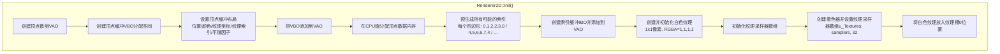
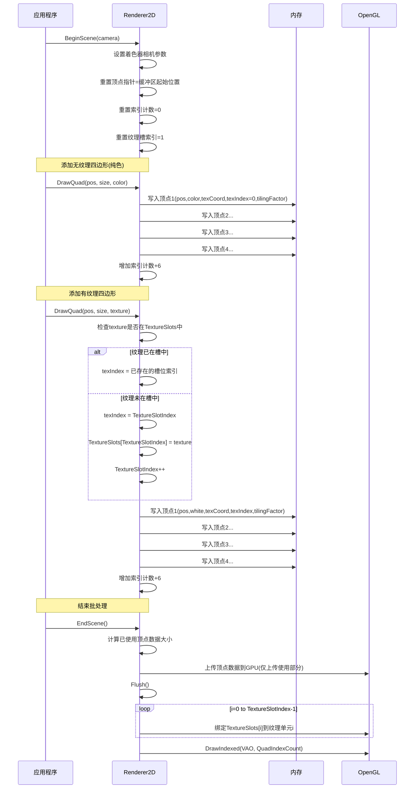
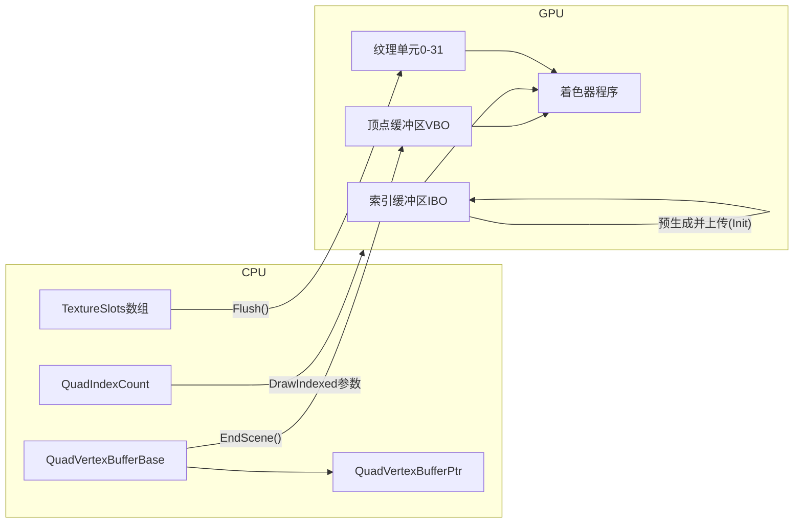

# 批处理渲染流程分析

1. **初始化阶段**:
   - 顶点数组(VAO)和顶点缓冲(VBO)确实是首先创建的
   - 预分配的是CPU端顶点缓冲区(`QuadVertexBufferBase`)，而不是"整个VB数组"
   - 白色纹理会被放在纹理槽0，这是一个重要的设计细节

2. **BeginScene阶段**:
   - 不只是初始化相机，还会设置着色器的视图投影矩阵

3. **数据添加**:
   - 索引计数器(`QuadIndexCount`)会随着每个四边形增加6

4. **EndScene阶段**:
   - 实际上会先计算使用的数据大小，只上传已使用部分
   - Flush中会循环绑定所有使用的纹理到对应槽位

## 修正的批处理渲染流程图

### 初始化流程

### 场景渲染流程

### 数据流转图

1. **预分配资源**: 一次性创建足够的缓冲区
2. **延迟渲染**: 收集所有数据后才执行实际绘制
3. **纹理合并**: 通过纹理索引让不同顶点使用不同纹理
4. **一次提交**: 单次DrawCall渲染多个图形

这种实现使渲染系统既高效又灵活，能够处理大量的2D图形绘制需求。