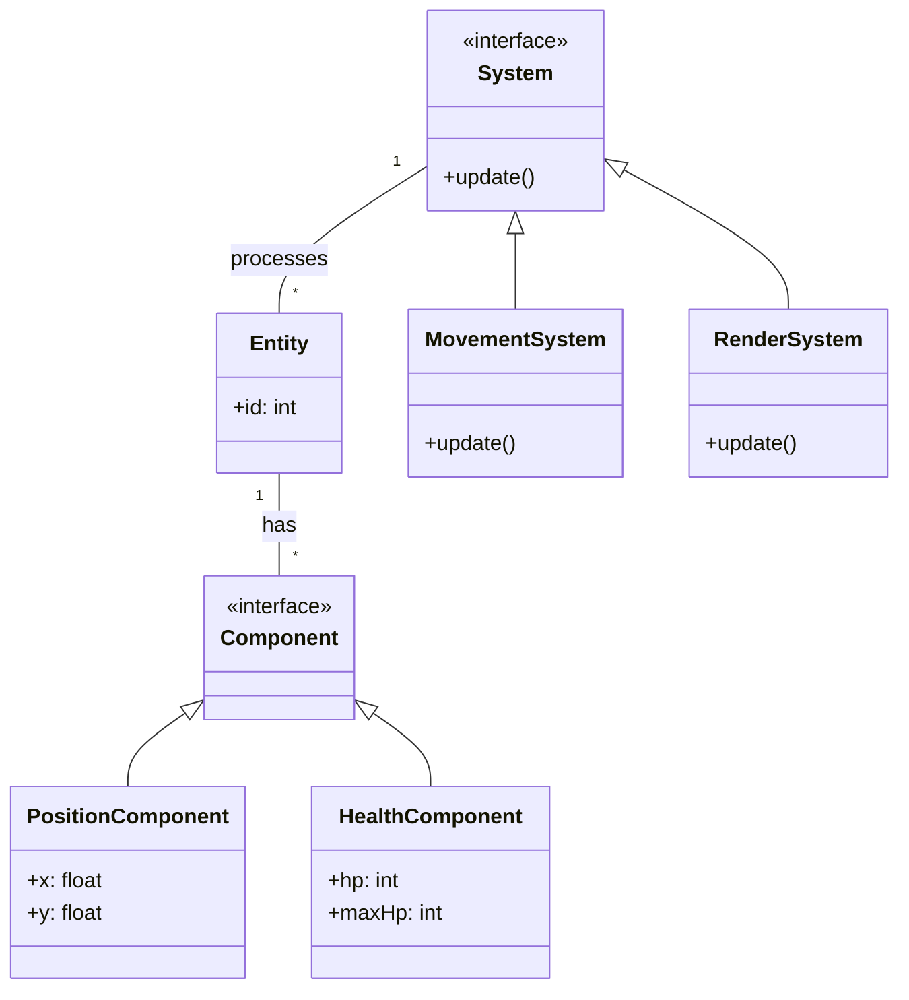
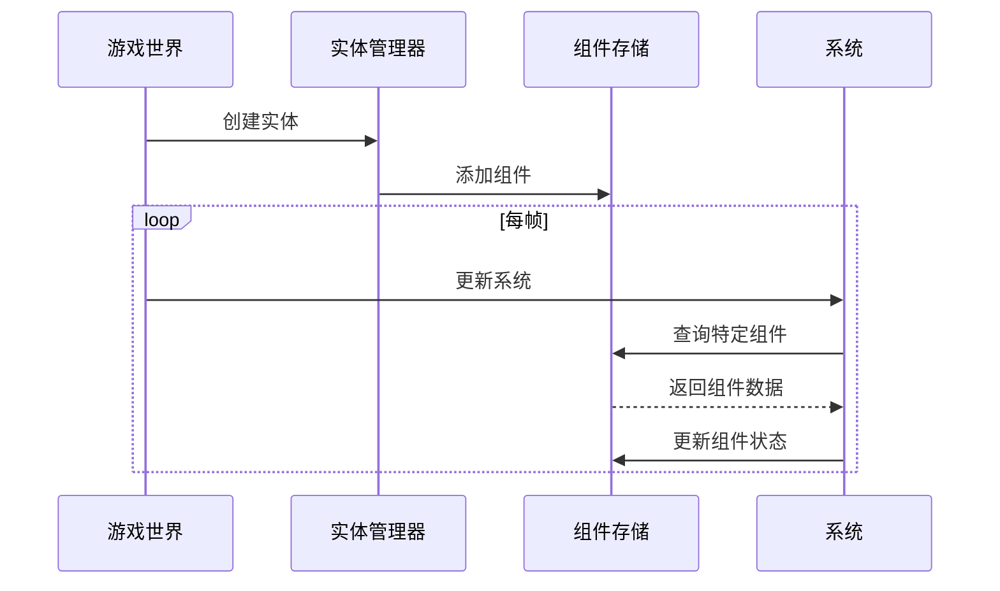
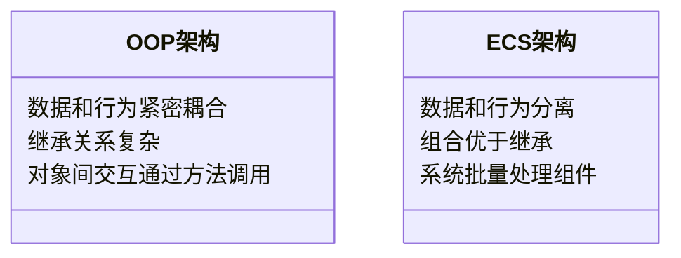
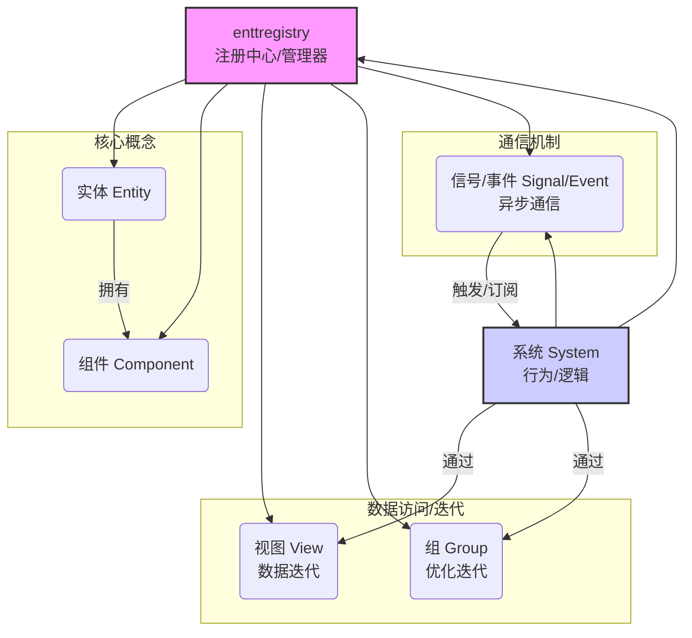

# ENTT

`entt` 是一个非常流行且高效的 C++ 实体-组件-系统（Entity-Component-System, ECS）库。它是一个只包含头文件的库，易于集成，并且在性能方面表现出色，尤其适用于游戏开发和需要高性能数据处理的应用程序。






------

### 1. 什么是 ECS？

实体-组件-系统 (ECS) 是一种架构模式，主要用于游戏开发和其他需要高度灵活和可扩展的数据结构的应用中。它的核心思想是将数据（Component）与行为（System）分离，并通过实体（Entity）来关联它们。

- **实体 (Entity):** 一个通用的标识符，本身没有数据或行为。它仅仅代表一个“事物”或“对象”。
- **组件 (Component):** 纯粹的数据结构。它们存储实体的属性或状态。例如，一个实体可能有一个 `Position` 组件（存储位置信息）和一个 `Velocity` 组件（存储速度信息）。
- **系统 (System):** 包含逻辑或行为的代码。系统操作具有特定组件组合的实体。例如，一个 `MovementSystem` 可能会查找所有具有 `Position` 和 `Velocity` 组件的实体，并根据速度更新它们的位置。

ECS 的优势在于：

- **组合优于继承：** 通过组合不同的组件来构建实体，避免了复杂的继承层次结构。这使得添加新功能或修改现有功能变得更加容易。
- **数据导向设计：** 组件是纯数据，这有助于将相关数据存储在内存中连续的区域，从而提高缓存效率和整体性能。
- **灵活性和可扩展性：** 可以轻松地添加、移除或修改组件和系统，而不会影响代码库的其他部分。

### 2. `entt` 的核心概念

`entt` 库围绕以下核心概念构建：

- **Registry (`entt::registry`)**: 这是 `entt` 的核心。它负责管理实体及其组件。你可以将其视为一个中央数据库，所有实体和组件都存储在这里。Registry 提供了创建、销毁实体，添加、移除、获取组件以及创建视图和组等功能。
- **Entity (`entt::entity`)**: 一个轻量级的类型别名，通常是一个整数类型，用于唯一标识 Registry 中的一个实体。实体本身不存储任何数据。
- **Component**: 任何 Plain Old Data (POD) 结构体或类都可以作为组件。组件应该只包含数据，不包含复杂的逻辑或虚函数（虽然非虚函数和简单方法是允许的，但为了最佳实践和数据导向设计，推荐只包含数据）。

### 3. `entt` 的主要特性和用法

#### Registry 的使用

创建一个 `entt::registry` 对象是使用 `entt` 的第一步：

```C++
#include <entt/entt.hpp>

entt::registry registry;
```

#### 创建和管理实体

通过 Registry 创建新的实体：

```cpp
entt::entity entity = registry.create();
```

销毁实体及其所有关联的组件：

```c++
registry.destroy(entity);
```

检查实体是否有效（未被销毁）：

```c++
bool is_valid = registry.valid(entity);
```

#### 添加、获取和移除组件

为实体添加组件：

```c++
struct Position { float x, y; };
struct Velocity { float dx, dy; };

registry.emplace<Position>(entity, 10.0f, 20.0f); // 添加 Position 组件并初始化数据
registry.emplace<Velocity>(entity, 1.0f, 0.5f);   // 添加 Velocity 组件
```

获取实体的组件（返回组件的引用）：

```c++
Position& pos = registry.get<Position>(entity);
pos.x += 5.0f;
```

检查实体是否具有某个组件：

```c++
bool has_velocity = registry.any_of<Velocity>(entity);
```

移除实体的组件：

```c++
registry.remove<Position>(entity);
```

一次性移除实体上的所有组件：

```c++
registry.clear<Position, Velocity>(); // 移除所有实体上的 Position 和 Velocity 组件
```

#### Views 和 Groups：如何高效迭代实体

Views 和 Groups 是 `entt` 中用于高效迭代具有特定组件组合的实体的关键机制。这是系统实现逻辑的基础。

- **Views (`entt::view`)**: Views 提供了对具有一个或多个特定组件的实体的只读或读写访问。当你需要迭代所有具有 *至少* 某些组件的实体时使用 Views。Views 是惰性求值的，它们在迭代时才查找符合条件的实体。

  单组件 View：

  ```c++
  // 迭代所有具有 Position 组件的实体
  for (auto entity : registry.view<Position>()) {
      Position& pos = registry.get<Position>(entity);
      // 处理 Position 数据
  }
  ```

  多组件 View：

  C++

  ```c++
  // 迭代所有同时具有 Position 和 Velocity 组件的实体
  for (auto entity : registry.view<Position, Velocity>()) {
      auto& pos = registry.get<Position>(entity);
      auto& vel = registry.get<Velocity>(entity);
      // 处理 Position 和 Velocity 数据 (例如，更新位置)
      pos.x += vel.dx;
      pos.y += vel.dy;
  }
  
  // 或者使用 structured binding (C++17)
  for (auto [entity, pos, vel] : registry.view<Position, Velocity>().each()) {
      // 处理 pos 和 vel
      pos.x += vel.dx;
      pos.y += vel.dy;
  }
  ```

  `entt::view<...>::each()` 返回一个迭代器，支持结构化绑定，使得代码更简洁。

- **Groups (`entt::group`)**: Groups 是一种更强大的机制，它在组件被添加或移除时维护一个内部列表，从而实现更快的迭代。当你需要频繁迭代具有 *精确* 某些组件组合的实体，并且这些组件的添加/移除相对不频繁时，Groups 可以提供更好的性能。Groups 需要在 Registry 中显式创建。

  创建 Group：

  ```c++
  // 创建一个 Group，包含所有同时拥有 Position 和 Velocity 组件的实体
  // DestroyPolicy::PushBack 是一种策略，用于处理实体销毁时的行为
  auto group = registry.group<Position, Velocity>(); // 默认策略
  ```

  迭代 Group：

  ```c++
  // 迭代 Group 中的实体，速度比 View 更快
  for (auto entity : group) {
      auto& pos = group.get<Position>(entity);
      auto& vel = group.get<Velocity>(entity);
      // 处理 Position 和 Velocity 数据
      pos.x += vel.dx;
      pos.y += vel.dy;
  }
  
  // 或者使用 structured binding (C++17)
   for (auto [entity, pos, vel] : registry.group<Position, Velocity>().each()) {
      // 处理 pos 和 vel
      pos.x += vel.dx;
      pos.y += vel.dy;
  }
  ```

选择 Views 还是 Groups 取决于你的使用场景。如果组件的添加/移除操作频繁，或者你只需要偶尔迭代，Views 可能更合适。如果需要频繁迭代某个固定的组件组合，并且组件变化不频繁，Groups 通常能提供更好的性能。

#### Signals/Events：事件系统

`entt` 提供了一个灵活的信号/事件系统，允许不同的部分（通常是系统）之间进行通信，而无需直接依赖。你可以定义各种事件，并允许函数或方法订阅这些事件。

定义事件类型：

```c++
struct EntityCreatedEvent {
    entt::entity entity;
};
```

获取事件总线并发布事件：

```c++
// 获取 EntityCreatedEvent 类型的 sink (用于连接/断开回调)
auto& sink = registry.on_construct<Position>(); // 当 Position 组件被添加到实体时触发

// 连接一个回调函数
sink.connect<&on_position_constructed>();

void on_position_constructed(entt::registry& reg, entt::entity entity) {
    // 当 Position 组件被创建时执行的代码
    std::cout << "Position component added to entity: " << static_cast<unsigned int>(entity) << std::endl;
}

// 在创建 Position 组件时会自动触发连接的回调
registry.emplace<Position>(entity, 0.0f, 0.0f);
```

`entt` 支持多种类型的事件：`on_construct` (组件创建)、`on_destroy` (组件销毁)、`on_update` (组件更新 - 实验性)。

#### Serialization：序列化支持

`entt` 内置了对实体和组件进行序列化和反序列化的支持，通常与第三方序列化库（如 Cereal, Boost.Serialization, or others）结合使用。这对于保存和加载游戏状态或应用程序数据非常有用。

基本思路是使用 Registry 提供的 `snapshot` 和 `loader` 功能，配合序列化库来处理组件数据。

```c++
#include <entt/entt.hpp>
#include <cereal/archives/binary.hpp>
#include <fstream>

// 确保组件是可序列化的 (例如，通过 Cereal 的宏)
struct SerializablePosition {
    float x, y;
    template<class Archive>
    void serialize(Archive& archive) {
        archive(x, y);
    }
};

// ... 创建 Registry 并添加实体和组件 ...

// 序列化
std::ofstream os("registry.dat", std::ios::binary);
cereal::binary_oarchive oarchive(os);
entt::snapshot snapshot(registry);
snapshot.entities(oarchive);
snapshot.component<SerializablePosition>(oarchive);
// ... 序列化其他组件 ...

// 反序列化
std::ifstream is("registry.dat", std::ios::binary);
cereal::binary_iarchive iarchive(is);
entt::registry loaded_registry;
entt::snapshot_loader loader(loaded_registry);
loader.entities(iarchive);
loader.component<SerializablePosition>(iarchive);
// ... 反序列化其他组件 ...
```

#### 其他高级特性

- **Non-owning Pointers (`entt::non_owning_ptr`)**: 用于在不拥有对象的情况下安全地引用 Registry 中的对象，防止野指针。
- **Runtime Reflection (实验性)**: `entt` 正在开发运行时反射功能，允许在运行时查询和操作组件和实体信息。
- **Custom Storage**: 允许为特定组件类型使用自定义存储结构，以满足特殊需求。
- **Dependency Management**: 可以管理系统之间的依赖关系。

### 4. 为什么选择 `entt`？

- **高性能:** `entt` 设计时高度关注性能和缓存效率，其 Views 和 Groups 机制提供了快速的数据迭代能力。
- **只包含头文件:** 集成非常简单，只需将头文件复制到你的项目中即可。
- **功能丰富:** 提供了 ECS 的核心功能，以及事件系统、序列化支持等实用特性。
- **灵活且易于使用:** API 设计直观，学习曲线相对平缓。
- **活跃的社区:** 有一个活跃的社区，提供了良好的支持和持续的更新。
- **C++17 支持:** 充分利用了 C++17 的特性，例如结构化绑定，使得代码更加简洁。

### 5. 如何开始使用 `entt`

1. **获取 `entt`:** 最简单的方法是从 GitHub 仓库克隆或下载最新的 `entt.hpp` 头文件。
2. **包含头文件:** 在你的 C++ 代码中包含 `entt/entt.hpp`。
3. **创建 Registry:** 实例化 `entt::registry` 对象。
4. **定义组件:** 创建你的组件结构体（纯数据）。
5. **创建和管理实体/组件:** 使用 Registry 的方法创建实体、添加/获取/移除组件。
6. **实现系统:** 编写函数或类来操作具有特定组件的实体，使用 Views 或 Groups 进行迭代。





