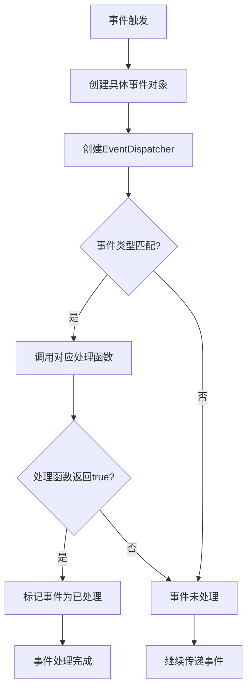
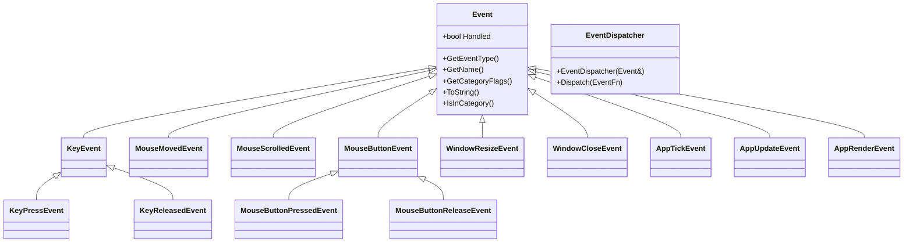
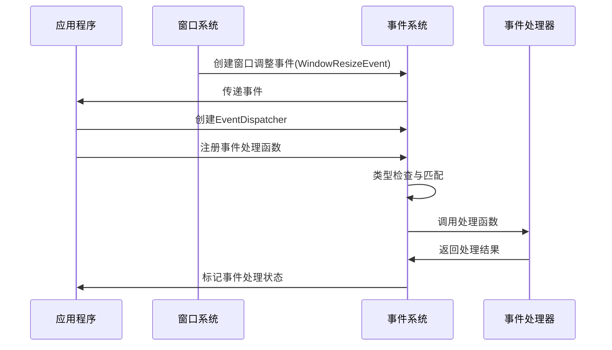

# Razel事件系统

## 事件系统设计与实现

设计：

### 1. 事件系统概述

- 事件系统是游戏引擎的重要组成部分，用于处理各种事件，例如鼠标点击、键盘按键和窗口调整大小。
- 当前事件系统是阻塞的，这意味着事件发生时，应用程序会停止并处理该事件。
- 未来可能会将事件缓冲到事件总线中。

### 2. 事件类

- `Event` 类是所有事件的基类，包含 `handled` 标志，用于指示事件是否已被处理。
- `Event` 类还包含虚函数，例如 `getEventType()`，`getName()` 和 `getCategoryFlags()`。
- `isInCategory()` 是一个实用函数，用于检查事件是否属于给定的类别。

```cpp
// 作为所有事件的基类
class RAZEL_API Event 
{
	//friend class EventDispatcher;
public:
	
	virtual EventType GetEventType() const = 0;					// 获取事件类型
	virtual const char* GetName() const = 0;					// 获取事件名称
	virtual int GetCategoryFlags() const = 0;					// 获取事件类别标签
	virtual std::string ToString() const { return GetName(); }	// 返回事件类型的字符串表示

	// 检查事件是否属于特定类别（IsHasCategory？）
	inline bool IsInCategory(EventCategory category) const
	{
		return GetCategoryFlags() & category;
	}

private:
	bool m_Handled = false;		// 事件是否被处理
};
```

### 3. 事件类型和类别

- `EventType` 枚举类定义了各种事件类型，例如 `WindowResize`，`KeyPressed` 和 `MouseMoved`。
- `EventCategory` 枚举类定义了事件的类别，例如 `Keyboard`，`Mouse` 和 `Input`。
- 事件可以属于多个类别（类似于epoll等中的设计）。

```cpp
	// 事件类型
	enum class EventType
	{
		None = 0,
		WindowClose,WindowResize,WindowFocus,WindowLostFocus,WindowMoved,	// 窗口事件
		AppTick,AppUpdate,AppRender,										// 应用事件
		KeyPressed,KeyReleased,												// 键盘事件
		MouseButtonPressed,MouseButtonReleased,MouseMoved,MouseScrolled		// 鼠标事件

	};

	// 事件类别
	enum EventCategory
	{
		None = 0,
		EventCategoryApplication	= BIT(0),	//应用程序事件
		EventCategoryInput			= BIT(1),	//输入事件
		EventCategoryKeyboard		= BIT(2),	//键盘事件
		EventCategoryMouse			= BIT(3),	//鼠标事件
		EventCategoryMouseButton	= BIT(4)	//鼠标点击事件
	};
```

### 4. 事件分发器

- `EventDispatcher` 类用于根据事件类型分发事件。
- `Dispatch()` 函数接受一个事件处理函数，如果事件类型匹配，则调用该函数。

```cpp
// 事件分发器
class EventDispatcher
{
	template<typename T>
	using EventFn = std::function<bool(T&)>;
public:
	EventDispatcher(Event& event)
		:m_Event(event){}

	// 分发事件，通过创建一个EventDispatcher实例后，可以接受任意类型的event，然后去调用dispatch进行分发
	template<typename T>
	bool Dispatch(EventFn<T> func)
	{
        //判断该事件是否属于T类型事件
		if (m_Event.GetEventType() == T::GetStaticType())
		{
			// 如果是则将m_Event类型进行强制转换为对应的事件类型后，便于调用对应事件类型的方法
			m_Event.m_Handled = func(*(T*)&m_Event);
			return true;	//表示事件已被处理
		}
		return false;		//表示事件未被处理
	}

private:
	Event& m_Event;
};
```

事件分发（Dispatch）指的是**根据事件类型匹配并调用相应的事件处理函数**，而不是简单地将事件“投递”到某个地方。

- **事件（Event）**：发生的特定情况，如键盘按下、鼠标点击等。
- **事件类型（EventType）**：用于标识不同类型的事件（如 `KeyPressedEvent`、`MouseClickedEvent`）。
- **事件分发器（EventDispatcher）**：根据事件的类型，调用匹配的事件处理逻辑。

调用方式实例：

```cpp
void OnEvent(Event& event) {
    EventDispatcher dispatcher(event);

    dispatcher.Dispatch<KeyPressedEvent>([](KeyPressedEvent& e) {
        std::cout << "Key Pressed: " << e.GetKeyCode() << std::endl;
        return true;
    });

    dispatcher.Dispatch<MouseButtonPressedEvent>([](MouseButtonPressedEvent& e) {
        std::cout << "Mouse Clicked!" << std::endl;
        return true;
    });
}
```

**执行逻辑：**

- `dispatcher.Dispatch<KeyPressedEvent>(lambda)`
  - 如果 `event` 是 `KeyPressedEvent`，执行 `lambda`。
  - 否则，跳过。
- `dispatcher.Dispatch<MouseButtonPressedEvent>(lambda)`
  - 如果 `event` 是 `MouseButtonPressedEvent`，执行 `lambda`。
  - 否则，跳过。

#### 对比事件注册

| 方式                       | 机制                                       | 适用场景                                             |
| -------------------------- | ------------------------------------------ | ---------------------------------------------------- |
| **事件注册（map存储）**    | 先存入 `map`，事件触发时查找匹配的处理函数 | 适用于**全局事件管理**，可动态注册或移除事件处理函数 |
| **即时分发（Dispatch<>）** | 事件触发时，检查类型并执行 `lambda`        | 适用于**局部、临时事件处理**，无需存储回调函数       |


### 5. 应用程序和窗口事件分发

- 应用程序和窗口：
  - 应用程序类是引擎的中心枢纽，包含运行循环等重要内容。
  - 窗口类代表应用程序的实际窗口，例如带有标题栏的窗口。
- 事件：
  - 当窗口中发生事件（如调整大小、关闭、鼠标移动、键盘事件等）时，窗口类会收到一个事件回调。
  - 窗口类会构造一个Hazel事件，并将其传递回应用程序。
- 事件分发：
  - 为了避免窗口类直接依赖于应用程序类，应用程序会向窗口提供一个回调函数。
  - 当窗口收到事件时，它会检查回调函数是否存在，如果存在，则使用事件数据调用该回调函数。
  - 应用程序类具有一个名为`onEvent`的函数，该函数接收事件引用。窗口类会使用事件数据调用此函数。
  - 应用程序收到事件后，可以将其分发给需要它的任何对象，例如层堆栈。
- 事件监听器：
  - 除了使用函数指针作为回调，还可以创建一个事件监听器接口（例如`IEventListener`）。
  - 窗口类可以维护一个`IEventListener`的集合，并在事件发生时遍历该集合并调用其`onEvent`函数。
  - 应用程序类和层都可以实现`IEventListener`接口，并将其自身注册为窗口的事件监听器。
- 事件类型和分发器：
  - 需要创建所有类型的事件类，例如窗口事件（调整大小、关闭）和输入事件（鼠标按钮按下、鼠标移动、按键按下、按键释放）。
  - 还可以创建应用程序事件，例如运行循环事件（更新、Tick、渲染）。
  - 事件分发器类可以根据事件类型将事件分发到不同的函数。
- 阻塞事件与缓冲事件：
  - 目前使用的是阻塞事件，即收到事件后立即处理，可能会暂停其他事件。
  - 未来可以考虑实现缓冲事件系统，将事件信息存储在队列中，并在每帧处理队列中的所有事件。

### 6. 代码编写顺序

1. **`event.h`**：定义事件基类和通用接口。
2. **`application_event.h`、`key_event.h`、`mouse_event.h`**：定义具体的事件类。
3. **`event_dispatcher.h`**：实现事件分发器。
4. **`Application` 类**：集成事件系统到引擎中，并编写测试代码。
5. **`premake5.lua`、`core.h`、`log.h`**：完善辅助功能。

### 7. 总结

- 通过回调函数机制，窗口类实现了与应用程序类的解耦。
- 窗口类只负责接收和传递事件，而具体的事件处理逻辑则由应用程序类来负责。
- 这种设计使得代码更加灵活、可维护，也更易于扩展。
- 为了解决阻塞问题，可以考虑异步事件处理、事件缓冲等改进措施。

## 详细代码设计

好的，让我逐步讲解这个事件系统的各个组成部分。

### 第一部分：事件基础设施

#### 1. Event.h - 核心基类和类型定义

##### 事件类型枚举
```cpp
enum class EventType {
    None = 0,
    WindowClose, WindowResize, WindowFocus, WindowLostFocus, WindowMoved,
    AppTick, AppUpdate, AppRender,
    KeyPressed, KeyReleased,
    MouseButtonPressed, MouseButtonReleased, MouseMoved, MouseScrolled
};
```
这个枚举定义了所有可能的事件类型，使用强类型枚举（enum class）确保类型安全。

##### 事件类别
```cpp
enum EventCategory {
    None = 0,
    EventCategoryApplication = BIT(0),  // 1
    EventCategoryInput      = BIT(1),  // 2
    EventCategoryKeyboard   = BIT(2),  // 4
    EventCategoryMouse      = BIT(3),  // 8
    EventCategoryMouseButton = BIT(4)  // 16
};
```
使用位标志来定义事件类别，这样一个事件可以属于多个类别。例如：
```cpp
EventCategoryKeyboard | EventCategoryInput  // 结果为 6 (二进制: 110)
```

##### 辅助宏
```cpp
#define EVENT_CLASS_TYPE(type) \
    static EventType GetStaticType() { return EventType::##type; }\
    virtual EventType GetEventType() const override { return GetStaticType(); }\
    virtual const char* GetName() const override { return #type; }
```
这个宏为每个事件类自动生成三个必要的函数：
- GetStaticType(): 静态函数，返回事件类型
- GetEventType(): 虚函数，返回具体实例的类型
- GetName(): 返回事件类型的字符串表示

##### Event基类
```cpp
class Event {
public:
    virtual EventType GetEventType() const = 0;
    virtual const char* GetName() const = 0;
    virtual int GetCategoryFlags() const = 0;
    virtual std::string ToString() const { return GetName(); }

    inline bool IsInCategory(EventCategory category) const {
        return GetCategoryFlags() & category;
    }

protected:
    bool m_Handled = false;
};
```
这是所有事件的基类，定义了事件系统的基本接口。

### 第二部分：事件分发器

```cpp
class EventDispatcher {
    template<typename T>
    using EventFn = std::function<bool(T&)>;

public:
    EventDispatcher(Event& event) : m_Event(event) {}

    template<typename T>
    bool Dispatch(EventFn<T> func) {
        if (m_Event.GetEventType() == T::GetStaticType()) {
            m_Event.m_Handled = func(*(T*)&m_Event);
            return true;
        }
        return false;
    }

private:
    Event& m_Event;
};
```

事件分发器的工作原理：
1. 构造时接收一个事件引用
2. Dispatch函数使用模板来处理不同类型的事件
3. 检查事件类型是否匹配，如果匹配则调用处理函数

### 第三部分：具体事件类型

#### 1. 应用事件 (ApplicationEvent.h)

```cpp
class WindowResizeEvent : public Event {
public:
    WindowResizeEvent(unsigned int width, unsigned int height)
        : m_Width(width), m_Height(height) {}

    // 获取窗口新的尺寸
    inline unsigned int GetWidth() { return m_Width; }
    inline unsigned int GetHeight() { return m_Height; }

    std::string ToString() const override {
        std::stringstream ss;
        ss << "WindowResizeEvent " << m_Width << ", " << m_Height;
        return ss.str();
    }

    EVENT_CLASS_TYPE(WindowResize)
    EVENT_CLASS_CATEGORY(EventCategoryApplication)

private:
    unsigned int m_Width, m_Height;
};
```

#### 2. 键盘事件 (KeyEvent.h)

```cpp
// 键盘事件基类
class KeyEvent : public Event {
public:
    inline int GetKeyCode() const { return m_KeyCode; }
    EVENT_CLASS_CATEGORY(EventCategoryKeyboard | EventCategoryInput)

protected:
    KeyEvent(int keycode) : m_KeyCode(keycode) {}
    int m_KeyCode;
};

// 按键按下事件
class KeyPressEvent : public KeyEvent {
public:
    KeyPressEvent(int keycode, int repeatCount)
        : KeyEvent(keycode), m_RepeatCount(repeatCount) {}

    inline int GetRepeatCount() const { return m_RepeatCount; }
    EVENT_CLASS_TYPE(KeyPressed)

private:
    int m_RepeatCount;
};
```

#### 3. 鼠标事件 (MouseEvent.h)

```cpp
class MouseMovedEvent : public Event {
public:
    MouseMovedEvent(float x, float y)
        : m_MouseX(x), m_MouseY(y) {}

    inline float GetX() const { return m_MouseX; }
    inline float GetY() const { return m_MouseY; }

    EVENT_CLASS_TYPE(MouseMoved)
    EVENT_CLASS_CATEGORY(EventCategoryMouse | EventCategoryInput)

private:
    float m_MouseX, m_MouseY;
};
```

### 使用示例

```cpp
void OnEvent(Event& e) {
    EventDispatcher dispatcher(e);
    
    // 分发窗口调整大小事件
    dispatcher.Dispatch<WindowResizeEvent>([](WindowResizeEvent& e) {
        // 处理窗口大小改变
        std::cout << e.ToString() << std::endl;
        return true;
    });
    
    // 分发键盘事件
    dispatcher.Dispatch<KeyPressEvent>([](KeyPressEvent& e) {
        // 处理按键
        std::cout << "Key pressed: " << e.GetKeyCode() << std::endl;
        return true;
    });
}
```

这个事件系统的设计非常灵活和可扩展，通过继承和模板的使用，可以轻松添加新的事件类型，同时保持类型安全和代码的可维护性。


## 相关问题

### 为什么时间都要设计成一个类

#### 1. 面向对象的优势

##### 封装性
```cpp
class WindowResizeEvent : public Event {
private:
    unsigned int m_Width, m_Height;  // 数据封装
public:
    inline unsigned int GetWidth() { return m_Width; }  // 接口封装
    inline unsigned int GetHeight() { return m_Height; }
};
```

- 数据和行为被封装在一起
- 可以控制数据的访问方式
- 确保数据的完整性和有效性

##### 继承性
```cpp
// 基类定义共同接口
class KeyEvent : public Event {
protected:
    int m_KeyCode;
public:
    inline int GetKeyCode() const { return m_KeyCode; }
};

// 子类复用代码
class KeyPressEvent : public KeyEvent {
private:
    int m_RepeatCount;
public:
    inline int GetRepeatCount() const { return m_RepeatCount; }
};
```

- 避免代码重复
- 建立清晰的事件层级关系
- 方便统一管理共同特性

##### 多态性
```cpp
void ProcessEvent(Event& event) {  // 接收基类引用
    if (event.GetEventType() == EventType::WindowResize) {
        auto& resizeEvent = static_cast<WindowResizeEvent&>(event);
        // 处理窗口调整事件
    }
}
```

- 通过基类指针/引用处理不同类型的事件
- 运行时动态确定事件类型
- 支持事件的统一处理和分发

#### 2. 类型安全

##### 编译时类型检查
```cpp
template<typename T>
bool EventDispatcher::Dispatch(EventFn<T> func) {
    // 编译时确保T是Event的子类
    static_assert(std::is_base_of<Event, T>::value, 
                 "T must be derived from Event!");
    // ...
}
```

- 避免运行时错误
- 编译器可以捕获类型错误
- 提供更好的IDE支持

#### 3. 扩展性

##### 添加新事件类型
```cpp
// 轻松添加新的事件类型
class CustomEvent : public Event {
    // 新的事件数据和行为
    EVENT_CLASS_TYPE(Custom)
    EVENT_CLASS_CATEGORY(EventCategoryApplication)
};
```

- 不需要修改现有代码
- 保持开闭原则
- 方便添加新功能

##### 事件处理器的扩展
```cpp
class WindowLayer {
    void OnEvent(Event& e) {
        EventDispatcher dispatcher(e);
        // 可以方便地添加新的事件处理
        dispatcher.Dispatch<CustomEvent>(BIND_EVENT_FN(OnCustomEvent));
    }
};
```

#### 4. 功能完整性

##### 事件状态和行为
```cpp
class MouseMovedEvent : public Event {
private:
    float m_MouseX, m_MouseY;
public:
    // 状态查询
    inline float GetX() const { return m_MouseX; }
    inline float GetY() const { return m_MouseY; }
    
    // 行为
    bool IsInWindow() const {
        return m_MouseX >= 0 && m_MouseY >= 0;
    }
    
    // 调试信息
    std::string ToString() const override {
        return fmt::format("MouseMoved: {}, {}", m_MouseX, m_MouseY);
    }
};
```

- 可以包含事件相关的状态
- 可以定义事件特定的行为
- 支持调试和序列化

#### 5. 与现代C++特性配合

##### 智能指针支持
```cpp
std::unique_ptr<Event> CreateEvent() {
    return std::make_unique<WindowResizeEvent>(800, 600);
}
```

##### Lambda表达式和std::function
```cpp
dispatcher.Dispatch<WindowResizeEvent>([](WindowResizeEvent& e) {
    // 使用lambda处理事件
    return true;
});
```

#### 总结

将事件设计成类的好处：
1. 提供了完整的面向对象特性（封装、继承、多态）
2. 保证了类型安全
3. 提供了良好的扩展性
4. 支持完整的事件状态和行为管理
5. 与现代C++特性完美配合
6. 便于调试和维护
7. 提供了统一的接口和处理方式

这种设计虽然可能看起来比简单的枚举或结构体复杂，但在大型项目中能提供更好的可维护性和扩展性。

## 事件分发流程



## 事件类层次结构



## 事件使用示例
