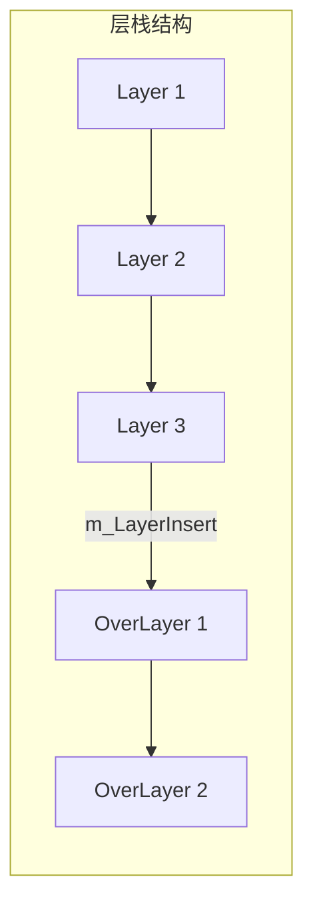
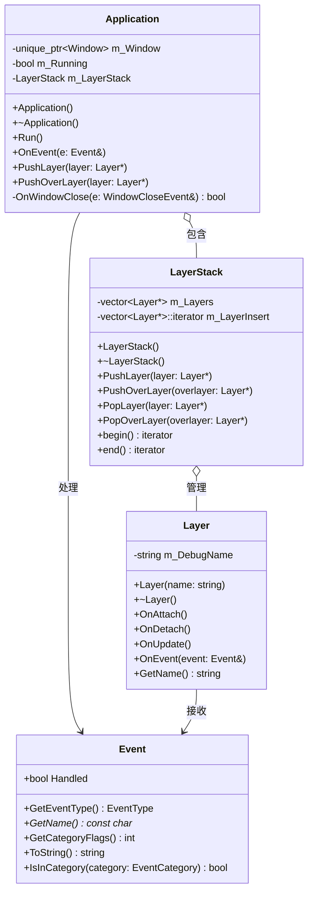
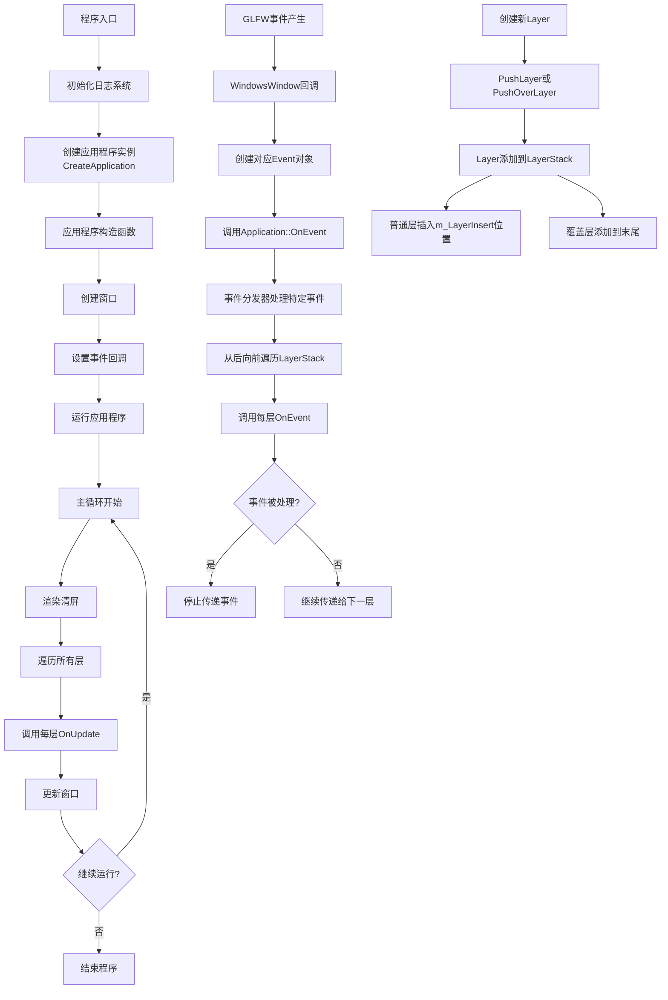

# 层与层栈

| 普通层栈 (Layer Stack) | 叠加层栈 (Overlay Stack) |

- 层可以处理事件，并选择是否将事件传递给下层
- 层的更新顺序是从前往后（底层到顶层）
- 事件处理顺序是从后往前（顶层到底层）
- 覆盖层总是位于普通层之上
- 支持动态添加和移除层

## 核心概念

LayerStack通过分层的方式组织代码和功能。这种设计类似于Photoshop的图层系统，允许不同功能模块以层的形式添加到应用程序中。

## Layer类

```cpp
class Layer
{
public: 
    Layer(const std::string& name = "Layer");
    virtual ~Layer();

    virtual void OnAttach() {}          // 层被添加到层栈时调用
    virtual void OnDetach() {}          // 层被从层栈移除时调用
    virtual void OnUpdate() {}          // 每帧调用
    virtual void OnEvent(Event& event) {} // 事件处理

    inline const std::string& GetName() const { return m_DebugName; }

private:
    std::string m_DebugName;
};
```

Layer是一个可被继承的基类，定义了以下生命周期方法：
| 方法         | 作用             | 典型用途                   |
| ------------ | ---------------- | -------------------------- |
| `OnAttach()` | 当层被添加时调用 | 初始化资源、设置状态       |
| `OnDetach()` | 当层被移除时调用 | 释放资源、取消订阅         |
| `OnUpdate()` | 每帧更新         | 处理游戏逻辑、动画、输入   |
| `OnEvent()`  | 事件触发时调用   | 处理键盘、鼠标、窗口等事件 |


## LayerStack类




```cpp
class LayerStack
{
    // |--------------------层栈--------------------------|
    // | 普通层栈 (Layer Stack) | 覆盖层栈 (Overlay Stack) |
public:
    LayerStack();
    ~LayerStack();

    void PushLayer(Layer* layer);            // 添加普通层
    void PushOverLayer(Layer* overlayer);    // 添加覆盖层
    void PopLayer(Layer* layer);             // 移除普通层
    void PopOverLayer(Layer* overlayer);     // 移除覆盖层

    std::vector<Layer*>::iterator begin() { return m_Layers.begin(); }
    std::vector<Layer*>::iterator end() { return m_Layers.end(); }

private:
    std::vector<Layer*> m_Layers;                    // 存储层栈的所有层指针
    std::vector<Layer*>::iterator m_LayerInsert;    // 指当前栈中应该插入新层位置（普通层和覆盖层的分界线）
};
```

LayerStack负责管理层的集合，具有以下特点：
- 将层分为两类：**普通层**和**覆盖层**
- 普通层位于栈的前部分，覆盖层位于栈的后部分
- `m_LayerInsert`迭代器标记了普通层和覆盖层的分界点
- 普通层使用`emplace`在特定位置插入
- 覆盖层使用`emplace_back`添加到栈尾

|                  | 普通层（Layer）                                              | 叠加层（Overlay）                         |
| ---------------- | ------------------------------------------------------------ | ----------------------------------------- |
| **存储位置**     | `m_Layers.begin()` 到 `m_LayerInsertIndex`                   | `m_LayerInsertIndex` 到 `m_Layers.end()`  |
| **Push 方式**    | 插入 `m_LayerInsertIndex` 位置，并更新索引                   | 直接 `emplace_back()` 添加到末尾          |
| **Pop 方式**     | 在 `[0, m_LayerInsertIndex)` 查找并删除，减少 `m_LayerInsertIndex` | 在 `[m_LayerInsertIndex, end)` 查找并删除 |
| **更新顺序**     | 先更新                                                       | 后更新                                    |
| **事件处理顺序** | 后处理                                                       | 先处理                                    |
| **作用**         | 处理核心游戏逻辑                                             | 处理 UI、调试信息等                       |
| **添加位置**     | 层堆栈前半部分                                               | 层堆栈末尾                                |
| **渲染顺序**     | 按层堆栈顺序                                                 | 最后渲染                                  |
| **事件处理顺序** | 事件最后才传递到普通层                                       | 事件优先处理                              |

### 架构优势

1. **模块化**：将应用功能分解为独立的层
2. **灵活性**：可动态添加和移除功能
3. **控制执行顺序**：
   - 渲染和更新从底向上（前向后）
   - 事件处理从上向下（后向前）
4. **事件传播控制**：层可以选择是否拦截事件
5. **区分UI和游戏逻辑**：覆盖层通常用于UI元素，普通层用于游戏逻辑

### 实际应用示例

```cpp
class ExampleLayer : public Razel::Layer
{
public:
    ExampleLayer() : Layer("Example") {}

    void OnUpdate() override
    {
        RZ_INFO("ExampleLayer::Update");
    }

    void OnEvent(Razel::Event& event) override
    {
        RZ_TRACE("{0}", event);
    }
};

// 在应用程序中使用
Sandbox::Sandbox()
{
    PushLayer(new ExampleLayer());
}
```

这种分层架构使Razel引擎能够以组合方式构建复杂应用，同时保持代码的模块化和可维护性。层

简单来说，**普通层负责游戏运行，叠加层负责显示额外信息**。

```mermaid
graph TD
    subgraph "层次架构概览"
        A[应用程序 Application] --> B[层栈 LayerStack]
        B --> C1[普通层 Layer]
        B --> C2[普通层 Layer]
        B --> D1[覆盖层 OverLayer]
        B --> D2[覆盖层 OverLayer]
    end

    subgraph "LayerStack内部结构"
        E[vector<Layer*>] --> F[普通层区域]
        E --> G[m_LayerInsert 分界线]
        E --> H[覆盖层区域]
    end

    subgraph "层的生命周期"
        I[创建层] --> J[PushLayer/PushOverLayer]
        J --> K[OnAttach 调用]
        K --> L[每帧 OnUpdate]
        L --> M[事件触发 OnEvent]
        M --> N[PopLayer/PopOverLayer]
        N --> O[OnDetach 调用]
        O --> P[销毁层]
    end

    subgraph "事件传播流程"
        Q[窗口事件] --> R[Application::OnEvent]
        R --> S[从上到下遍历层栈]
        S --> T{层处理事件}
        T -->|事件已处理| U[停止传播]
        T -->|事件未处理| V[继续传播到下一层]
    end

    subgraph "更新流程"
        W[Application::Run] --> X[从下到上遍历层栈]
        X --> Y[每层调用OnUpdate]
    end
```



类结构关系




## 当前的程序执行流程



