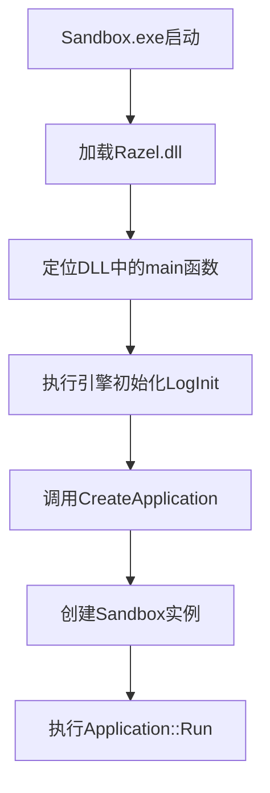
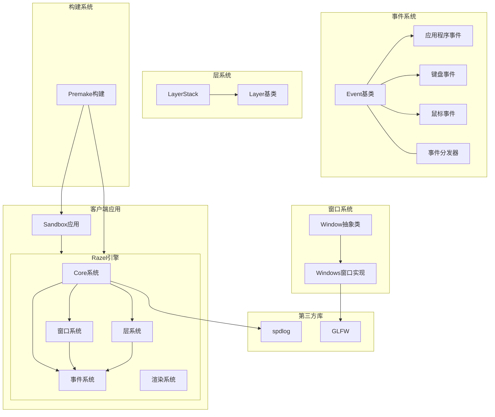
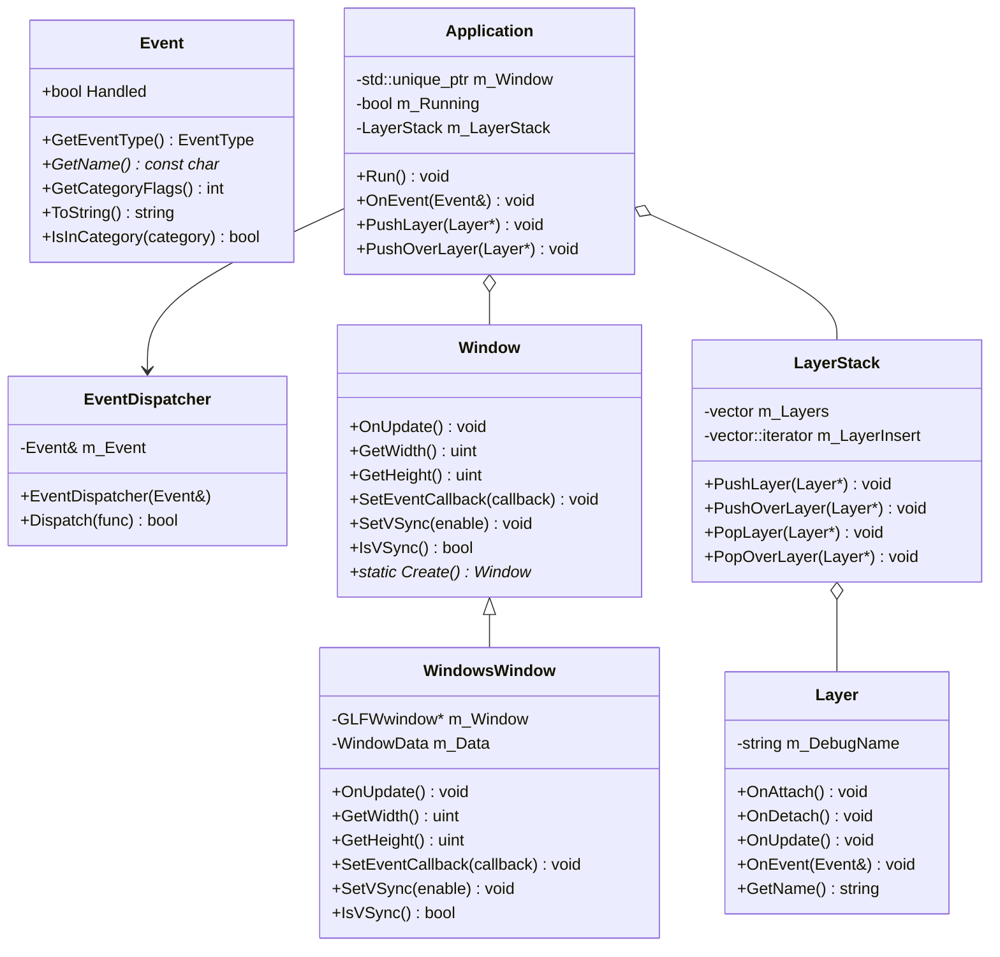

## 架构设计

1. **DLL架构的优势**
- 分离核心引擎和应用程序：Razel作为游戏引擎核心被编译为DLL，而Sandbox作为客户端应用程序
- 模块化：便于引擎代码的复用和维护
- 动态链接：可以在不重新编译应用程序的情况下更新引擎功能

2. **入口点设计 (EntryPoint.h)**
将main函数放在引擎DLL中而不是应用程序中有以下好处：

- **统一的初始化流程**：
```cpp
int main(int argc, char** argv)
{
    Razel::Log::Init();  // 引擎核心功能初始化
    // ... 其他引擎初始化代码 ...
    auto app = Razel::CreateApplication();  // 创建用户应用
    app->Run();  // 运行应用
    delete app;
}
```

- **控制反转（IoC）**：
```cpp
class Sandbox : public Razel::Application
{
public:
    Sandbox() { }
    ~Sandbox() { }
};

// 用户只需实现这个工厂函数
Razel::Application* Razel::CreateApplication()
{
    return new Sandbox();
}
```

3. **设计优点**
- **封装性**：用户不需要关心引擎的初始化细节
- **一致性**：保证所有使用此引擎的应用程序都遵循相同的启动流程
- **可扩展性**：引擎可以在入口点统一添加新的初始化步骤，而不需要用户修改代码
- **跨平台**：可以在入口点根据不同平台提供不同的初始化逻辑

这种设计模式类似于许多成熟的游戏引擎（如Unreal Engine），通过将复杂性封装在引擎中，让开发者专注于游戏逻辑的实现，而不是底层细节。

## 启动流程

让我详细解释这个设计模式下的程序启动流程：

1. **启动流程图**


2. **详细启动步骤**

(1) **首先，Sandbox.exe启动**
```cpp:SandBox/src/SandboxApp.cpp
// 用户代码只需定义应用类和工厂函数
class Sandbox : public Razel::Application {
    // ...
};

Razel::Application* Razel::CreateApplication() {
    return new Sandbox();
}
```

(2) **加载Razel.dll并寻找入口点**
- Windows加载器发现程序依赖Razel.dll
- 加载DLL并解析符号
- 找到main函数作为实际入口点

(3) **执行DLL中的main函数**
```cpp
int main(int argc, char** argv)
{
    // 引擎核心初始化
    Razel::Log::Init();
    RZ_CORE_INFO("Hello");
    
    // 创建应用实例
    auto app = Razel::CreateApplication();  // 调用用户定义的工厂函数
    
    // 运行应用主循环
    app->Run();
    
    // 清理
    delete app;
}
```

3. **关键点说明**

- **符号导出**：
  - Razel.dll需要正确导出CreateApplication的符号
  - 通过`extern`关键字声明这个函数是在其他地方定义的

- **头文件组织**：
```cpp
#pragma once

// 暴露给用户的接口
#include "Razel/Application.h"
#include "Razel/Log.h"

// 入口点定义
#include "Razel/EntryPoint.h"
```

4. **优势**
- 引擎可以完全控制程序的生命周期
- 统一的错误处理和资源管理
- 可以在不影响用户代码的情况下添加新的初始化步骤
- 便于调试，因为引擎可以在启动早期就设置好调试环境

这种设计模式实现了一个"框架式"的结构，用户的代码被嵌入到引擎提供的框架中运行，而不是直接控制程序的执行流程。这样可以确保所有使用该引擎的程序都遵循相同的启动和初始化流程，提高了代码的可维护性和一致性。

## "Sandbox"的含义与作用

在Razel引擎中，"Sandbox"（沙盒）具有以下几个重要含义：

- 隔离测试环境："沙盒"本意是指一个受控且隔离的环境，开发者可以在其中安全地测试代码和功能，而不会影响主系统

- 客户端应用示例：Sandbox是一个使用Razel引擎API的客户端应用程序，展示了如何使用引擎创建实际应用

- 演示与测试：作为引擎的第一个实际应用，它允许开发者测试和验证引擎的各种功能

- 学习工具：对于新用户，它提供了一个学习如何使用引擎API的简单示例





