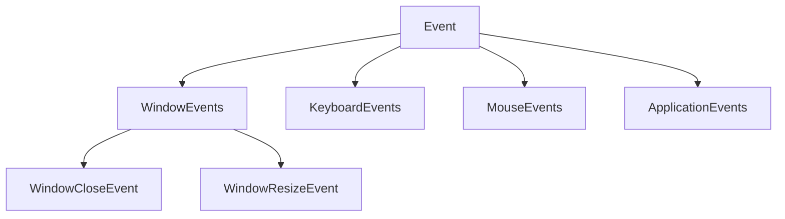

# 窗口事件
这个项目是一个游戏引擎或图形应用框架，名为Razel，看起来是基于GLFW库来处理跨平台窗口和输入事件。让我分析一下它的窗口事件系统设计和事件触发流程。

核心组件和设计模式：

1. 事件系统 (Event System)：
   - 基于一个基类 `Event`（在`Event.h`中定义）
   - 使用了事件分发器 `EventDispatcher` 来处理事件
   - 事件分类为不同类型：WindowEvents, ApplicationEvents, KeyEvents, MouseEvents等
   - 使用了观察者模式，通过回调函数处理事件

2. 窗口抽象 (Window Abstraction)：
   - `Window`是一个抽象基类，定义了跨平台窗口接口
   - `WindowsWindow`是Windows平台的具体实现
   - 使用了工厂模式创建窗口（`Window::Create`）
   - 窗口包含事件回调机制

3. 应用程序循环 (Application Loop)：
   - `Application`类管理主循环和事件处理
   - 通过`OnEvent`方法处理所有事件

窗口事件触发流程：

1. 事件源头 - GLFW回调：
   - GLFW库会监听底层操作系统事件
   - 在`WindowsWindow.cpp`中，我们可以看到设置了多个GLFW回调函数

2. 事件转换 - GLFW到Razel：
   - 当GLFW触发回调时，会创建相应的Razel事件（如WindowResizeEvent）
   - 将事件传递给预设的回调函数（`m_Data.EventCallback`）

3. 事件分发 - 传递给Application：
   - 事件最终传递到`Application::OnEvent`
   - `EventDispatcher`用于将事件发送到特定的处理函数

4. 事件处理 - 具体响应：
   - 特定事件处理函数执行相应逻辑（如`Application::OnWindowClose`）

# Razel引擎窗口事件系统详解

## 窗口事件系统设计

Razel引擎实现了一个完整的事件系统，主要通过以下组件构成：

### 1. 事件基础架构



### 2. 核心组件

- **Event基类**：所有事件的基础，提供事件类型、类别和处理标记
- **EventDispatcher**：负责事件分发到具体处理函数
- **Window抽象类**：平台无关的窗口接口
- **WindowsWindow**：Windows平台的实现
- **Application**：管理主循环和事件处理

## 窗口事件触发流程

当一个窗口事件（如调整大小）发生时，完整流程如下：

### 1. 操作系统层面触发事件

操作系统检测到用户操作（如拖动窗口边缘改变大小）。

### 2. GLFW库捕获系统事件

GLFW在不同平台有不同实现：
- Windows平台：通过Windows消息处理（WM_SIZE等）
- X11平台：通过X11事件系统
- Wayland/Cocoa：各自平台事件机制

例如，在Windows平台下，当窗口大小改变时：

```c
case WM_SIZE:
{
    const int width = LOWORD(lParam);
    const int height = HIWORD(lParam);
    // ...
    if (width != window->win32.width || height != window->win32.height)
    {
        window->win32.width = width;
        window->win32.height = height;
        _glfwInputFramebufferSize(window, width, height);
        _glfwInputWindowSize(window, width, height);
    }
    // ...
}
```

### 3. GLFW回调到Razel引擎

在`WindowsWindow.cpp`中，初始化阶段设置了GLFW回调：

```cpp
glfwSetWindowSizeCallback(m_Window, [](GLFWwindow* window, int width, int height) 
{
    // 获取窗口数据指针
    WindowData& data = *(WindowData*)glfwGetWindowUserPointer(window);
    
    // 更新窗口尺寸数据
    data.Width = width;
    data.Height = height;
    
    // 创建窗口大小变化事件
    WindowResizeEvent event(width, height);
    
    // 调用回调函数处理事件
    data.EventCallback(event);
});
```

### 4. 创建Razel事件对象

当回调触发时，会创建一个`WindowResizeEvent`对象：

```cpp
WindowResizeEvent event(width, height);
```

该事件包含新的窗口宽度和高度信息。

### 5. 事件传递到Application层

事件通过`m_Data.EventCallback`（实际上是`Application::OnEvent`）传递到应用程序：

```cpp
void Application::OnEvent(Event& e)
{
    EventDispatcher dispatcher(e);
    dispatcher.Dispatch<WindowCloseEvent>(BIND_EVENT_FN(Application::OnWindowClose));

    RZ_CORE_TRACE("{0}", e);
}
```

### 6. 事件分发和处理

`EventDispatcher`检查事件类型并分发到对应的处理函数：

```cpp
template<typename T>
bool Dispatch(EventFn<T> func)
{
    if (m_Event.GetEventType() == T::GetStaticType())
    {
        m_Event.m_Handled = func(*(T*)&m_Event);
        return true;
    }
    return false;
}
```

## 关键机制详解

### 1. 事件类型识别

Razel使用宏定义自动生成事件类型识别代码：

```cpp
#define EVENT_CLASS_TYPE(type) static EventType GetStaticType(){return EventType::##type;}\
                             virtual EventType GetEventType()const override{return GetStaticType();}\
                             virtual const char* GetName() const override {return #type;}
```

### 2. 事件回调绑定

使用了C++11的`std::bind`绑定成员函数：

```cpp
#define BIND_EVENT_FN(x) std::bind(&x, this, std::placeholders::_1)

m_Window->SetEventCallback(BIND_EVENT_FN(Application::OnEvent));
```

### 3. 窗口数据访问

使用GLFW的用户指针机制存储和访问窗口关联数据：

```cpp
// 设置窗口用户指针
glfwSetWindowUserPointer(m_Window, &m_Data);

// 在回调中获取
WindowData& data = *(WindowData*)glfwGetWindowUserPointer(window);
```

### 4. 主循环中的事件轮询

应用程序主循环通过GLFW轮询事件：

```cpp
void Application::Run()
{
    while (m_Running)
    {
        glClearColor(1, 0, 1, 1);
        glClear(GL_COLOR_BUFFER_BIT);
        m_Window->OnUpdate();  // 内部调用glfwPollEvents()
    }
}
```

在`WindowsWindow::OnUpdate()`中：

```cpp
void WindowsWindow::OnUpdate() const
{
    glfwPollEvents();      // 处理所有待处理事件
    glfwSwapBuffers(m_Window);  // 交换缓冲区
}
```

## 例子：窗口关闭事件流程

1. 用户点击窗口关闭按钮
2. 操作系统生成关闭事件
3. GLFW捕获事件并调用设置的回调
4. 在回调中创建`WindowCloseEvent`
5. 事件传递到`Application::OnEvent`
6. `EventDispatcher`分发到`Application::OnWindowClose`
7. `Application::OnWindowClose`将`m_Running`设为false
8. 主循环在下一次迭代时退出

这种设计实现了事件系统与平台和应用逻辑的良好分离，使引擎具有良好的跨平台能力和可扩展性。